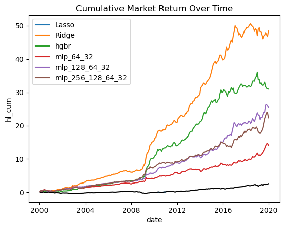

  <h1 className="text-4xl font-light">About</h1>
      <h2 className="py-2 text-lg font-light text-gray-500">
          Mechanical Engineering and Finance Graduate
      </h2>
     

    Financial Modeling
    

    

      Mechanical Design
    

    

      Data Science
    

      

       Recent Graduate of
      <a href="https://www.lehigh.edu/" className="text-sky-700">
      Lehigh University 
      </a>
      . My undergraduate scope as a Mechanical Engineering and Finance
       major through the Lehigh <a href="https://ibe.lehigh.edu/" className="text-sky-700">
      Integrated Business and Engineering Honors Program 
      </a>provided me the ability to explore a wide range of topics, industries, 
       and intellectual endeavors. I was able to pursue and obtain minors in both Aerospace Engineering and Economics, highlighting a strong interest in the intersection of technology and business. 
      

      

       Alongside my academic pursuits, I was a walk-on member of the Lehigh University rowing team, where I competed in the 1st Varsity 8+ boat for all 4 years, receiving numerous personal and team accolades as I gained invaluable experience in teamwork, leadership, and relentless dedication. I also served as the Vice President of the Engineering Honors Society, Tau Beta Pi, the oldest and original chapter of the Engineering Honor Society in the United States.  
      

      

      In my final semester, I took a course with 
      <a className="text-sky-700" href="http://bowen.finance/"> Donald Bowen, </a> 
      titled Advanced Data Science for Investments. My work consisted of creating various event studies, including home price predictors, a natural language processor to forecast returns from 10-K filings, and a Neural Network to predict asset returns. 
      In that same span, I modeled a business jet for former NASA Astronaut Terry Hart's course, Aircraft Design. The aircraft was designed following rigorous aerodynamic analysis, and utilizing OpenVSP software I was able to model and test the aircraft.
      

      

          

  

---

## Portfolio

<!-- You can link to other websites, PDFs in this repo, and other pages in this repo -->

_**[Natural language processing 10-Ks to identify Return Trends](portfolio/report/report.md)**_

---

_**[Home Price Stacked Regression Predictor](portfolio/stacked%20regressors/model/model.md)**_

---

_**[Fitting Neural Networks to Predict Asset Returns](lehigh-asset-pricing.streamlit.app)**_

---

_**[Futuristic Business Jet](pdf/Mech328ClassOverview_GoogleDocs.pdf)**_

---

## Career Objectives

Combining MechE + Fin degrees in useful ways in the financial sector. 

---

## Hobbies

Rower at Lehigh University

Coffee Enthusiast

Running

Golf

---

Page template forked from <a href="https://github.com/evanca/quick-portfolio">evanca</a>

<!-- Remove above link if you don't want to attibute -->
