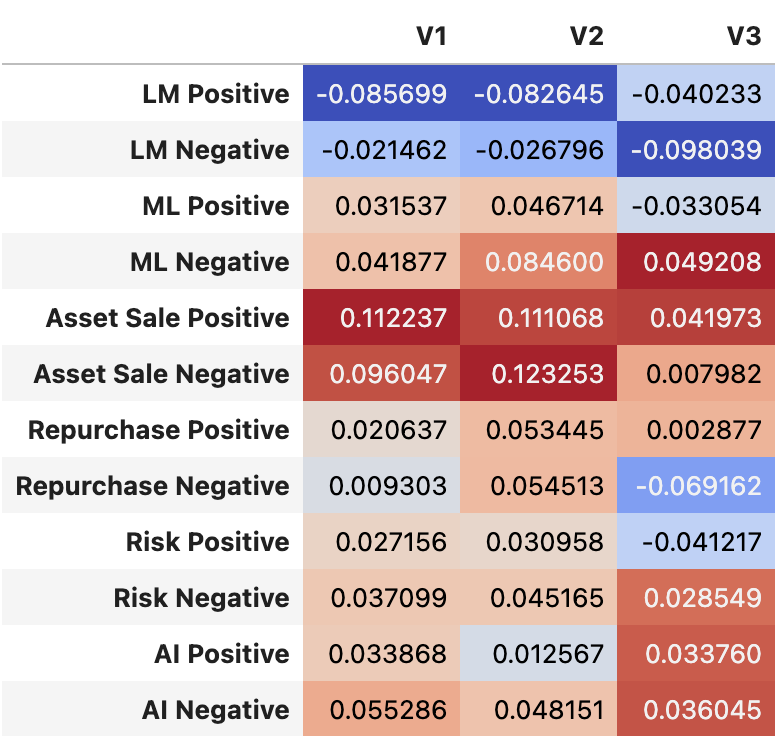
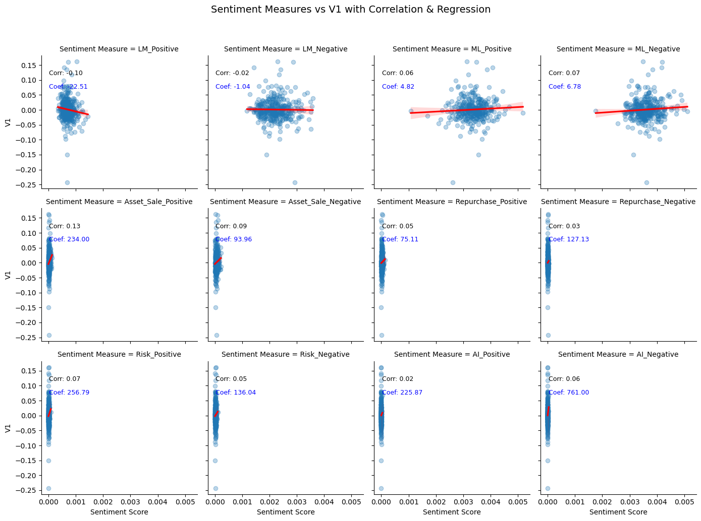
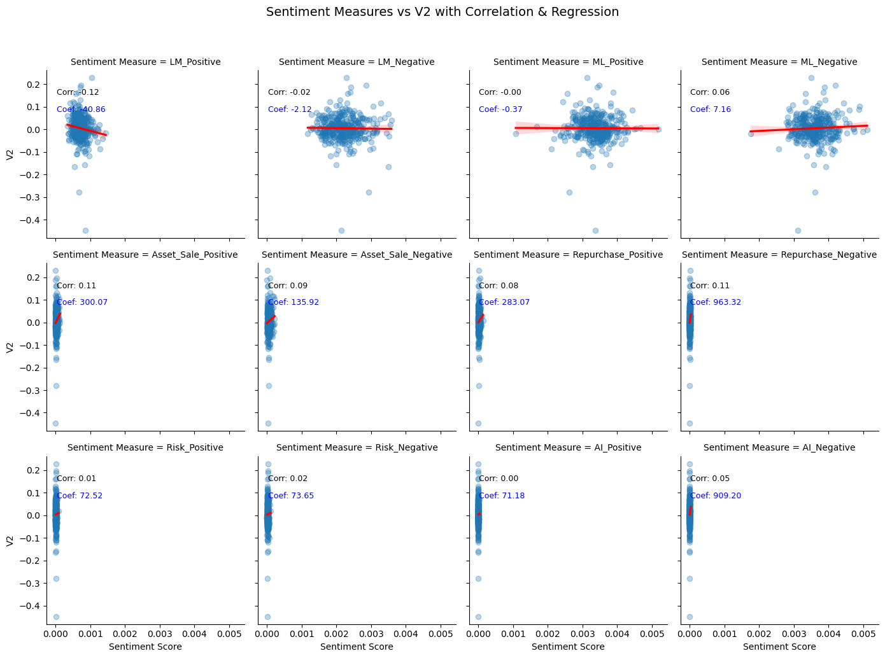
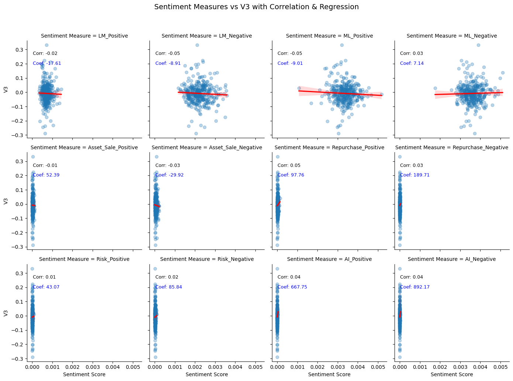

## Sentiment and Returns Analysis for S&P500 firms
By: Joseph Carruth

### Summary

This analysis looks at different levels of sentiment in a company's 10K to determine whether or not we can predict positive or negative returns following a 10K filing. The sentiment analysis was conducted on the 10K as a whole, as well as on 4 topics, including Divestitures, Share Repurchases, Risk Factors, and Artifical Intelligence. Using a returns database, we are then able to analyze returns around the date of the filing to better understand an investment timeline that would suit our needs given a sentiment analysis. 

I couldn't find any correlations between sentiment and returns.


### Data

#### The data we are sampling for this analysis is a list of all S&P500 firms and their subsequent 10Ks and returns in the year 2022. 

In order to get the return variables around the 10K, we must find the trading days normalized around the filing date. I ranked the dates after the filing and subtracted by 1 to get the first trading day as day 0. The code below shows the implementation. 
``` python
firm_ret_2022['trading_days_since_filing'] = firm_ret_2022[firm_ret_2022['date'] >= firm_ret_2022['Filing Date']].groupby('ticker')['date'].rank(method='first') - 1
```
I reversed the signs and took the negative value for the days before filing. 

Once you know the business days around the filing, you can begin analyzing returns. I pulled the return from the first business day using ```.loc[]``` to find the first trading day of the 10K filing. I then mapped these to the entire database by ticker. Version 2 required the same intuition, although this time I had to find the cumulative returns from the first filing day of business to two days after. The code cell below shows the steps I took to get the returns for this timetable.
``` python
version_2 = (
    firm_ret_2022.loc[
        firm_ret_2022['trading_days_since_filing'].between(0, 2) # inclusive between
    ]
    .groupby('ticker')['ret']
    .apply(lambda x: (1 + x).prod() - 1)  # Cumulative return formula, subtract 1 to get to actual return
)
```
Version 3 was the exact same code, replacing the ```.between(0,2)``` with ```.between(3,10)```.


The sentiment variables were built by generating regular expression variables to find the number of times positive or negative sentiment appeared in the text. This aptly describes the first four variables which used dictionaries of known positive and negative words. The last six sentiment variables were made by finding three topics. I used four topics: Divestiture, Stock Buybacks, Risk Factors, and Artificial Intelligence. Using the NEAR_regex function from the community codebook to create a regular expression format that looked for how close the topic words and sentiment dictionaries were in the text, we got a freqeuncy of the number of words in the company 10Ks that related to our topic and sentiment.  Dividng all our sentiment frequencies by their document length, we normalize the variable to analyze across the firms. 

There are 347 words in the LM positive dictionary, 2345 words in the LM negative dictionary, 75 words in the ML positive dictionary, and 94 words in the ML negative dictionary.

I chose my topics for the contextual sentiment analysis for reasons pertaining to my own areas of interest. Over my summer internship, I was fascinated with how firms seemed to perform after selling off assets and I wanted to see if I could better understand what was happening. Secondly, I was intrigued after sitting in on an earnings call to hear their plans for share repurchase, and subsequently expecting the stock to rise. Instead the stock fell, and I wanted to better understand a potential relationship. Lastly, I think communication about risk factors is super important and could lead to good data analysis. Artificial intelligence was another contextual option, but given the timing it didn't seem likely many firms would mention it. 


The sentiment measures do pass basic smell tests, as most firms have varying degrees of sentiment detected for their 10Ks. AI was the only sentiment that truly did not pass the smell test. 


### Results

|  |	1. Excess Return |	2. Excess Return |	3. Excess Return |	4. Excess Return |
| -- | -- | -- | -- | -- |
| Intercept	| 0.0119 | 0.0039 |	-0.0065 |	-0.0101 |
| | (0.0061)	| (0.0068)| (0.0104) |	(0.0117) |
| LM_Positive |	-16.5236	|  |  |  |		
|  | (8.6343)	|  |  | |				
| LM_Negative	|  |	-1.4686		| | |		
|  |  | 		(3.0748)	|  |  | 			
| ML_Positive	|  |  |		2.2148	|  |		
|  |  |  |		(3.1550)	|  |
| ML_Negative |  |  |	 |		3.0660 |
|  |  |  |  |	(3.2878) |


This vastly differs from the ML_JFE return table which had positive r-squared values. The only one with a positive r-squared value is LM_Positive. Despite not being able to see the r-squared values anymore, we can tell that the t-statistics are greater than the point estimates. Implying that they are not different from zero. I think there are control variables which are not being accounted for but I struggled to implement this analysis later on. 


```python
from IPython.display import Image
Image(filename='images/colorfultable.png') 
```


    

    


The return and sentiment analysis correlation table shows that there is seemingly a relationship between positive divestitures and returns shortly thereafter. There is also a strong negative correlation between LM negative and long term holds decreasing. 


```python
from IPython.display import Image
Image(filename='images/GraphV1.png') 

```


    

    


```python
Image(filename='images/GraphV2.png') 

```


    

    


```python
Image(filename='images/GraphV3.png') 
```


    

    


