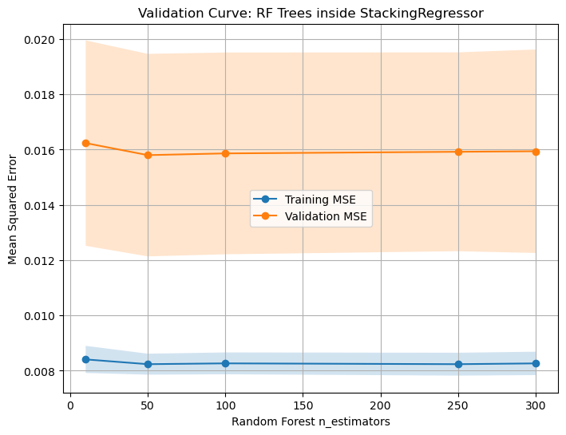
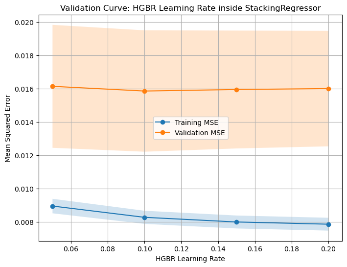
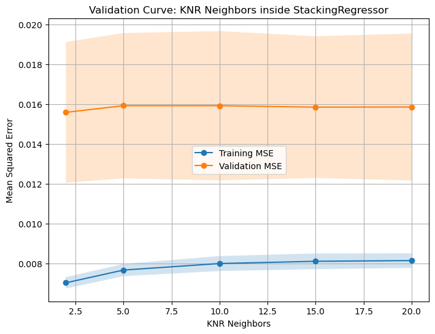

## Assignment 8 

Steps to this assignment. 

1. y-train is np.log(v_SalePrice), X_train is 
2. Preprocess the data
3. Tune params
4. K-Folds to test/validate model
5. Create Pipeline which does all of this 
6. Then at the very very end, test on holdout. 


```python
## Batch Import Packages from ML_Worksheet 3

import matplotlib.pyplot as plt
import numpy as np
import pandas as pd
from df_after_transform import df_after_transform
from sklearn import set_config
from sklearn.calibration import CalibrationDisplay
from sklearn.compose import (
    ColumnTransformer,
    make_column_selector,
    make_column_transformer,
)
from sklearn.decomposition import PCA
from sklearn.ensemble import HistGradientBoostingClassifier, RandomForestClassifier, RandomForestRegressor, HistGradientBoostingRegressor
from sklearn.feature_selection import (
    RFECV,
    SelectFromModel,
    SelectKBest,
    SequentialFeatureSelector,
    f_classif,
    f_regression,
)
from sklearn.impute import SimpleImputer
from sklearn.linear_model import Lasso, Ridge, LassoCV, LogisticRegression, RidgeCV, LinearRegression
from sklearn.metrics import (
    ConfusionMatrixDisplay,
    DetCurveDisplay,
    PrecisionRecallDisplay,
    RocCurveDisplay,
    classification_report,
    make_scorer,
)
from sklearn.model_selection import (
    GridSearchCV,
    KFold,
    cross_val_score,
    train_test_split,
    TunedThresholdClassifierCV
)
from sklearn.pipeline import Pipeline, make_pipeline
from sklearn.preprocessing import (
    OneHotEncoder,
    OrdinalEncoder,
    PolynomialFeatures,
    StandardScaler,
)
from sklearn.svm import LinearSVC


import warnings

warnings.filterwarnings("ignore")

warnings.filterwarnings("ignore", category=UserWarning, module="sklearn")
```


```python
## Importing the dataset

housing = pd.read_csv('input_data2/housing_train.csv')
y = np.log(housing.v_SalePrice)
housing = housing.drop('v_SalePrice',axis=1) # so not to include it in the training dataset
```


```python
# splitting the dataset into training and testing sets
rng = np.random.RandomState(0)
X_train, X_test, y_train, y_test = train_test_split(housing, y, random_state=rng)

```

## Preprocessing Pipeline


```python
# create a preprocessing pipeline for the data
cat_cols = housing.select_dtypes(include=['object']).columns[1:].tolist()  # Exclude the first column which is 'parcel'

exclude = ['parcel'] # Exclude 'parcel' from numerical columns as it is not a feature but an identifier
cat_include = ['v_Overall_Qual', 'v_MS_SubClass'] # Include 'v_Overall_Qual' in categorical columns

number_cols = housing.select_dtypes(include=np.number).columns.tolist()  # Get all numerical columns
cat_cols = cat_cols + cat_include

numer_pipe = make_pipeline(SimpleImputer(), # blank fill with mean for numerical vars
                           StandardScaler()) # then scale it

cat_pipe   = make_pipeline(SimpleImputer(strategy='most_frequent'), OneHotEncoder(handle_unknown='ignore')) # fill in missing values with the most frequent value, then one-hot encode

# combine those pipes into "preprocess" pipe

number_cols = [col for col in number_cols if col not in exclude and col not in cat_cols]
cat_cols = [col for col in cat_cols if col not in exclude and col not in number_cols]

preproc_pipe = ColumnTransformer(  
    [ # arg 1 of ColumnTransformer is a list, so this starts the list
    # a tuple for the numerical vars: name, pipe, which vars to apply to
    ("num_impute", numer_pipe, number_cols), # Excludes the first column which is 'parcel',
    # a tuple for the categorical vars: name, pipe, which vars to apply to
        
    ("cat_trans", cat_pipe, cat_cols) # Excludes the first column which is 'parcel')
    # exclude from number pipe n--> number pipe exclusion pattern equals pattern = 
    ]
    , # ColumnTransformer can take other args, most important: "remainder"
    remainder = 'drop' # you either drop or passthrough any vars not modified above
)


```


```python
from df_after_transform import df_after_transform

preproc_df = df_after_transform(preproc_pipe,housing)
print(f'There are {preproc_df.shape[1]} columns in the preprocessed data.')
preproc_df.describe().T.round(2)
```

    There are 325 columns in the preprocessed data.


<div>
<style scoped>
    .dataframe tbody tr th:only-of-type {
        vertical-align: middle;
    }

    .dataframe tbody tr th {
        vertical-align: top;
    }

    .dataframe thead th {
        text-align: right;
    }
</style>
<table border="1" class="dataframe">
  <thead>
    <tr style="text-align: right;">
      <th></th>
      <th>count</th>
      <th>mean</th>
      <th>std</th>
      <th>min</th>
      <th>25%</th>
      <th>50%</th>
      <th>75%</th>
      <th>max</th>
    </tr>
  </thead>
  <tbody>
    <tr>
      <th>v_Lot_Frontage</th>
      <td>1941.0</td>
      <td>-0.00</td>
      <td>1.00</td>
      <td>-2.21</td>
      <td>-0.42</td>
      <td>-0.00</td>
      <td>0.40</td>
      <td>11.13</td>
    </tr>
    <tr>
      <th>v_Lot_Area</th>
      <td>1941.0</td>
      <td>0.00</td>
      <td>1.00</td>
      <td>-1.13</td>
      <td>-0.37</td>
      <td>-0.11</td>
      <td>0.17</td>
      <td>19.72</td>
    </tr>
    <tr>
      <th>v_Overall_Cond</th>
      <td>1941.0</td>
      <td>-0.00</td>
      <td>1.00</td>
      <td>-4.20</td>
      <td>-0.52</td>
      <td>-0.52</td>
      <td>0.40</td>
      <td>3.16</td>
    </tr>
    <tr>
      <th>v_Year_Built</th>
      <td>1941.0</td>
      <td>-0.00</td>
      <td>1.00</td>
      <td>-3.29</td>
      <td>-0.61</td>
      <td>0.06</td>
      <td>0.98</td>
      <td>1.21</td>
    </tr>
    <tr>
      <th>v_Year_Remod/Add</th>
      <td>1941.0</td>
      <td>0.00</td>
      <td>1.00</td>
      <td>-1.64</td>
      <td>-0.92</td>
      <td>0.43</td>
      <td>0.96</td>
      <td>1.20</td>
    </tr>
    <tr>
      <th>...</th>
      <td>...</td>
      <td>...</td>
      <td>...</td>
      <td>...</td>
      <td>...</td>
      <td>...</td>
      <td>...</td>
      <td>...</td>
    </tr>
    <tr>
      <th>v_MS_SubClass_120</th>
      <td>1941.0</td>
      <td>0.07</td>
      <td>0.25</td>
      <td>0.00</td>
      <td>0.00</td>
      <td>0.00</td>
      <td>0.00</td>
      <td>1.00</td>
    </tr>
    <tr>
      <th>v_MS_SubClass_150</th>
      <td>1941.0</td>
      <td>0.00</td>
      <td>0.02</td>
      <td>0.00</td>
      <td>0.00</td>
      <td>0.00</td>
      <td>0.00</td>
      <td>1.00</td>
    </tr>
    <tr>
      <th>v_MS_SubClass_160</th>
      <td>1941.0</td>
      <td>0.04</td>
      <td>0.20</td>
      <td>0.00</td>
      <td>0.00</td>
      <td>0.00</td>
      <td>0.00</td>
      <td>1.00</td>
    </tr>
    <tr>
      <th>v_MS_SubClass_180</th>
      <td>1941.0</td>
      <td>0.01</td>
      <td>0.08</td>
      <td>0.00</td>
      <td>0.00</td>
      <td>0.00</td>
      <td>0.00</td>
      <td>1.00</td>
    </tr>
    <tr>
      <th>v_MS_SubClass_190</th>
      <td>1941.0</td>
      <td>0.02</td>
      <td>0.15</td>
      <td>0.00</td>
      <td>0.00</td>
      <td>0.00</td>
      <td>0.00</td>
      <td>1.00</td>
    </tr>
  </tbody>
</table>
<p>325 rows × 8 columns</p>
</div>


```python
lasso_pipe = make_pipeline(
    preproc_pipe,
    LassoCV())

# I used "Pipeline" not "make_pipeline" bc I wanted to name the steps
lasso_pipe = Pipeline([('columntransformer',preproc_pipe),
                 ('feature_create','passthrough'), 
                 ('feature_select','passthrough'), 
                 ('reg', LassoCV()),
                ])

```


```python
# This stacks multiple regression models together, using the predictions of the first models as features for the final model.
# The final model, IN THIS PIECE OF CODE COPIED FORM SKLEARN DOCS, is a Gradient Boosting Regressor.

from sklearn.linear_model import RidgeCV, LassoCV
from sklearn.neighbors import KNeighborsRegressor
estimators = [('ridge', RidgeCV()),
              ('lasso', LassoCV(random_state=42)),
              ('knr', KNeighborsRegressor(n_neighbors=20,
                                          metric='euclidean'))]
estimators2  =[('ridge', RidgeCV()),
               #('lasso', LassoCV(random_state=42, tol= 1e-6)),
               ('knr', KNeighborsRegressor(metric='euclidean', n_neighbors = 25)), 
               ('rf', RandomForestRegressor(n_estimators=100, random_state=42)),
               ('hgbr', HistGradientBoostingRegressor())]

from sklearn.ensemble import GradientBoostingRegressor
from sklearn.ensemble import StackingRegressor
final_estimator = GradientBoostingRegressor(
    n_estimators=25, subsample=0.5, min_samples_leaf=25, max_features=1,
    random_state=42)
reg_boss = StackingRegressor(
    estimators=estimators,
    final_estimator=final_estimator)

reg_boss2 = StackingRegressor(estimators=estimators2)

```


```python
gridsearch = GridSearchCV(
    lasso_pipe,
    param_grid=[ # linear models with built in coef selection
                 {'reg': [Ridge(alpha=a) for a in np.arange(1,12,5)], 
                 'feature_create':['passthrough']}, #,PolynomialFeatures(interaction_only=True)]},
                
                # GBR doesntt like sparse input arrays 
                {'reg':[HistGradientBoostingRegressor(), reg_boss, reg_boss2],
                 'columntransformer__cat_trans__onehotencoder__sparse_output':[False]}
                
                # OLS but with feature selection
                #{'reg':[LinearRegression()],
                 ## for OLS, create interactition but then prune back...
                 #'feature_create': [PolynomialFeatures(interaction_only=True)],
                 #'feature_select': [SelectKBest(f_regression, k=i) for i in [10,30,50,70] ]}
                #
                ],
    cv=5,
    scoring='r2',
    n_jobs=-1,
    verbose=3
)
```


```python
gridsearch2 = GridSearchCV(
    lasso_pipe,
    param_grid=[ # linear models with built in coef selection
                 {'reg': [reg_boss2],
                  'reg__rf__n_estimators': [250],

                  'reg__knr__n_neighbors': [5,10],
                  'reg__knr__weights': ['distance'],
                  # 'reg__knr__metric': ['euclidean', 'manhattan'], euclidean is better
                  
                  'reg__hgbr__learning_rate': [0.1],

                # (optional) tune final estimator inside reg_boss2
                  # 'reg__final_estimator__learning_rate': [0.05, 0.1],
                  # 'reg__final_estimator__n_estimators': [10, 25, 50],
                  'columntransformer__cat_trans__onehotencoder__sparse_output':[False]}
                
                # OLS but with feature selection
                #{'reg':[LinearRegression()],
                 ## for OLS, create interactition but then prune back...
                 #'feature_create': [PolynomialFeatures(interaction_only=True)],
                 #'feature_select': [SelectKBest(f_regression, k=i) for i in [10,30,50,70] ]}
                #
                ],
    cv=5,
    scoring='r2',
    n_jobs=-1,
    verbose=3
)
```


```python
gridsearch.fit(X_train, y_train)
```

    Fitting 5 folds for each of 6 candidates, totalling 30 fits
    [CV 2/5] END feature_create=passthrough, reg=Ridge(alpha=1);, score=0.818 total time=   0.2s
    [CV 1/5] END feature_create=passthrough, reg=Ridge(alpha=1);, score=0.827 total time=   0.2s
    [CV 2/5] END feature_create=passthrough, reg=Ridge(alpha=6);, score=0.825 total time=   0.2s
    [CV 3/5] END feature_create=passthrough, reg=Ridge(alpha=1);, score=0.898 total time=   0.2s
    [CV 1/5] END feature_create=passthrough, reg=Ridge(alpha=6);, score=0.847 total time=   0.1s
    [CV 3/5] END feature_create=passthrough, reg=Ridge(alpha=6);, score=0.896 total time=   0.1s
    [CV 4/5] END feature_create=passthrough, reg=Ridge(alpha=1);, score=0.924 total time=   0.2s
    [CV 5/5] END feature_create=passthrough, reg=Ridge(alpha=1);, score=0.876 total time=   0.2s
    [CV 4/5] END feature_create=passthrough, reg=Ridge(alpha=6);, score=0.925 total time=   0.1s
    [CV 5/5] END feature_create=passthrough, reg=Ridge(alpha=6);, score=0.878 total time=   0.1s
    [CV 1/5] END feature_create=passthrough, reg=Ridge(alpha=11);, score=0.847 total time=   0.1s
    [CV 3/5] END feature_create=passthrough, reg=Ridge(alpha=11);, score=0.893 total time=   0.1s
    [CV 2/5] END feature_create=passthrough, reg=Ridge(alpha=11);, score=0.822 total time=   0.1s
    [CV 4/5] END feature_create=passthrough, reg=Ridge(alpha=11);, score=0.926 total time=   0.1s
    [CV 5/5] END feature_create=passthrough, reg=Ridge(alpha=11);, score=0.876 total time=   0.1s
    [CV 2/5] END columntransformer__cat_trans__onehotencoder__sparse_output=False, reg=HistGradientBoostingRegressor();, score=0.898 total time=   3.2s
    [CV 1/5] END columntransformer__cat_trans__onehotencoder__sparse_output=False, reg=HistGradientBoostingRegressor();, score=0.886 total time=   3.3s
    [CV 3/5] END columntransformer__cat_trans__onehotencoder__sparse_output=False, reg=HistGradientBoostingRegressor();, score=0.896 total time=   3.3s
    [CV 5/5] END columntransformer__cat_trans__onehotencoder__sparse_output=False, reg=HistGradientBoostingRegressor();, score=0.889 total time=   3.3s
    [CV 4/5] END columntransformer__cat_trans__onehotencoder__sparse_output=False, reg=HistGradientBoostingRegressor();, score=0.935 total time=   3.3s
    [CV 2/5] END columntransformer__cat_trans__onehotencoder__sparse_output=False, reg=StackingRegressor(estimators=[('ridge', RidgeCV()),
                                  ('lasso', LassoCV(random_state=42)),
                                  ('knr',
                                   KNeighborsRegressor(metric='euclidean',
                                                       n_neighbors=20))],
                      final_estimator=GradientBoostingRegressor(max_features=1,
                                                                min_samples_leaf=25,
                                                                n_estimators=25,
                                                                random_state=42,
                                                                subsample=0.5));, score=0.879 total time=   5.9s
    [CV 3/5] END columntransformer__cat_trans__onehotencoder__sparse_output=False, reg=StackingRegressor(estimators=[('ridge', RidgeCV()),
                                  ('lasso', LassoCV(random_state=42)),
                                  ('knr',
                                   KNeighborsRegressor(metric='euclidean',
                                                       n_neighbors=20))],
                      final_estimator=GradientBoostingRegressor(max_features=1,
                                                                min_samples_leaf=25,
                                                                n_estimators=25,
                                                                random_state=42,
                                                                subsample=0.5));, score=0.879 total time=   6.0s
    [CV 1/5] END columntransformer__cat_trans__onehotencoder__sparse_output=False, reg=StackingRegressor(estimators=[('ridge', RidgeCV()),
                                  ('lasso', LassoCV(random_state=42)),
                                  ('knr',
                                   KNeighborsRegressor(metric='euclidean',
                                                       n_neighbors=20))],
                      final_estimator=GradientBoostingRegressor(max_features=1,
                                                                min_samples_leaf=25,
                                                                n_estimators=25,
                                                                random_state=42,
                                                                subsample=0.5));, score=0.868 total time=   6.3s
    [CV 4/5] END columntransformer__cat_trans__onehotencoder__sparse_output=False, reg=StackingRegressor(estimators=[('ridge', RidgeCV()),
                                  ('lasso', LassoCV(random_state=42)),
                                  ('knr',
                                   KNeighborsRegressor(metric='euclidean',
                                                       n_neighbors=20))],
                      final_estimator=GradientBoostingRegressor(max_features=1,
                                                                min_samples_leaf=25,
                                                                n_estimators=25,
                                                                random_state=42,
                                                                subsample=0.5));, score=0.925 total time=   5.5s
    [CV 5/5] END columntransformer__cat_trans__onehotencoder__sparse_output=False, reg=StackingRegressor(estimators=[('ridge', RidgeCV()),
                                  ('lasso', LassoCV(random_state=42)),
                                  ('knr',
                                   KNeighborsRegressor(metric='euclidean',
                                                       n_neighbors=20))],
                      final_estimator=GradientBoostingRegressor(max_features=1,
                                                                min_samples_leaf=25,
                                                                n_estimators=25,
                                                                random_state=42,
                                                                subsample=0.5));, score=0.894 total time=   6.0s
    [CV 2/5] END columntransformer__cat_trans__onehotencoder__sparse_output=False, reg=StackingRegressor(estimators=[('ridge', RidgeCV()),
                                  ('knr',
                                   KNeighborsRegressor(metric='euclidean',
                                                       n_neighbors=25)),
                                  ('rf', RandomForestRegressor(random_state=42)),
                                  ('hgbr', HistGradientBoostingRegressor())]);, score=0.893 total time=  34.3s
    [CV 1/5] END columntransformer__cat_trans__onehotencoder__sparse_output=False, reg=StackingRegressor(estimators=[('ridge', RidgeCV()),
                                  ('knr',
                                   KNeighborsRegressor(metric='euclidean',
                                                       n_neighbors=25)),
                                  ('rf', RandomForestRegressor(random_state=42)),
                                  ('hgbr', HistGradientBoostingRegressor())]);, score=0.892 total time=  34.3s
    [CV 3/5] END columntransformer__cat_trans__onehotencoder__sparse_output=False, reg=StackingRegressor(estimators=[('ridge', RidgeCV()),
                                  ('knr',
                                   KNeighborsRegressor(metric='euclidean',
                                                       n_neighbors=25)),
                                  ('rf', RandomForestRegressor(random_state=42)),
                                  ('hgbr', HistGradientBoostingRegressor())]);, score=0.903 total time=  34.4s
    [CV 5/5] END columntransformer__cat_trans__onehotencoder__sparse_output=False, reg=StackingRegressor(estimators=[('ridge', RidgeCV()),
                                  ('knr',
                                   KNeighborsRegressor(metric='euclidean',
                                                       n_neighbors=25)),
                                  ('rf', RandomForestRegressor(random_state=42)),
                                  ('hgbr', HistGradientBoostingRegressor())]);, score=0.893 total time=  33.0s
    [CV 4/5] END columntransformer__cat_trans__onehotencoder__sparse_output=False, reg=StackingRegressor(estimators=[('ridge', RidgeCV()),
                                  ('knr',
                                   KNeighborsRegressor(metric='euclidean',
                                                       n_neighbors=25)),
                                  ('rf', RandomForestRegressor(random_state=42)),
                                  ('hgbr', HistGradientBoostingRegressor())]);, score=0.946 total time=  33.2s


<style>#sk-container-id-1 {
  /* Definition of color scheme common for light and dark mode */
  --sklearn-color-text: black;
  --sklearn-color-line: gray;
  /* Definition of color scheme for unfitted estimators */
  --sklearn-color-unfitted-level-0: #fff5e6;
  --sklearn-color-unfitted-level-1: #f6e4d2;
  --sklearn-color-unfitted-level-2: #ffe0b3;
  --sklearn-color-unfitted-level-3: chocolate;
  /* Definition of color scheme for fitted estimators */
  --sklearn-color-fitted-level-0: #f0f8ff;
  --sklearn-color-fitted-level-1: #d4ebff;
  --sklearn-color-fitted-level-2: #b3dbfd;
  --sklearn-color-fitted-level-3: cornflowerblue;

  /* Specific color for light theme */
  --sklearn-color-text-on-default-background: var(--sg-text-color, var(--theme-code-foreground, var(--jp-content-font-color1, black)));
  --sklearn-color-background: var(--sg-background-color, var(--theme-background, var(--jp-layout-color0, white)));
  --sklearn-color-border-box: var(--sg-text-color, var(--theme-code-foreground, var(--jp-content-font-color1, black)));
  --sklearn-color-icon: #696969;

  @media (prefers-color-scheme: dark) {
    /* Redefinition of color scheme for dark theme */
    --sklearn-color-text-on-default-background: var(--sg-text-color, var(--theme-code-foreground, var(--jp-content-font-color1, white)));
    --sklearn-color-background: var(--sg-background-color, var(--theme-background, var(--jp-layout-color0, #111)));
    --sklearn-color-border-box: var(--sg-text-color, var(--theme-code-foreground, var(--jp-content-font-color1, white)));
    --sklearn-color-icon: #878787;
  }
}

#sk-container-id-1 {
  color: var(--sklearn-color-text);
}

#sk-container-id-1 pre {
  padding: 0;
}

#sk-container-id-1 input.sk-hidden--visually {
  border: 0;
  clip: rect(1px 1px 1px 1px);
  clip: rect(1px, 1px, 1px, 1px);
  height: 1px;
  margin: -1px;
  overflow: hidden;
  padding: 0;
  position: absolute;
  width: 1px;
}

#sk-container-id-1 div.sk-dashed-wrapped {
  border: 1px dashed var(--sklearn-color-line);
  margin: 0 0.4em 0.5em 0.4em;
  box-sizing: border-box;
  padding-bottom: 0.4em;
  background-color: var(--sklearn-color-background);
}

#sk-container-id-1 div.sk-container {
  /* jupyter's `normalize.less` sets `[hidden] { display: none; }`
     but bootstrap.min.css set `[hidden] { display: none !important; }`
     so we also need the `!important` here to be able to override the
     default hidden behavior on the sphinx rendered scikit-learn.org.
     See: https://github.com/scikit-learn/scikit-learn/issues/21755 */
  display: inline-block !important;
  position: relative;
}

#sk-container-id-1 div.sk-text-repr-fallback {
  display: none;
}

div.sk-parallel-item,
div.sk-serial,
div.sk-item {
  /* draw centered vertical line to link estimators */
  background-image: linear-gradient(var(--sklearn-color-text-on-default-background), var(--sklearn-color-text-on-default-background));
  background-size: 2px 100%;
  background-repeat: no-repeat;
  background-position: center center;
}

/* Parallel-specific style estimator block */

#sk-container-id-1 div.sk-parallel-item::after {
  content: "";
  width: 100%;
  border-bottom: 2px solid var(--sklearn-color-text-on-default-background);
  flex-grow: 1;
}

#sk-container-id-1 div.sk-parallel {
  display: flex;
  align-items: stretch;
  justify-content: center;
  background-color: var(--sklearn-color-background);
  position: relative;
}

#sk-container-id-1 div.sk-parallel-item {
  display: flex;
  flex-direction: column;
}

#sk-container-id-1 div.sk-parallel-item:first-child::after {
  align-self: flex-end;
  width: 50%;
}

#sk-container-id-1 div.sk-parallel-item:last-child::after {
  align-self: flex-start;
  width: 50%;
}

#sk-container-id-1 div.sk-parallel-item:only-child::after {
  width: 0;
}

/* Serial-specific style estimator block */

#sk-container-id-1 div.sk-serial {
  display: flex;
  flex-direction: column;
  align-items: center;
  background-color: var(--sklearn-color-background);
  padding-right: 1em;
  padding-left: 1em;
}


/* Toggleable style: style used for estimator/Pipeline/ColumnTransformer box that is
clickable and can be expanded/collapsed.
- Pipeline and ColumnTransformer use this feature and define the default style
- Estimators will overwrite some part of the style using the `sk-estimator` class
*/

/* Pipeline and ColumnTransformer style (default) */

#sk-container-id-1 div.sk-toggleable {
  /* Default theme specific background. It is overwritten whether we have a
  specific estimator or a Pipeline/ColumnTransformer */
  background-color: var(--sklearn-color-background);
}

/* Toggleable label */
#sk-container-id-1 label.sk-toggleable__label {
  cursor: pointer;
  display: block;
  width: 100%;
  margin-bottom: 0;
  padding: 0.5em;
  box-sizing: border-box;
  text-align: center;
}

#sk-container-id-1 label.sk-toggleable__label-arrow:before {
  /* Arrow on the left of the label */
  content: "▸";
  float: left;
  margin-right: 0.25em;
  color: var(--sklearn-color-icon);
}

#sk-container-id-1 label.sk-toggleable__label-arrow:hover:before {
  color: var(--sklearn-color-text);
}

/* Toggleable content - dropdown */

#sk-container-id-1 div.sk-toggleable__content {
  max-height: 0;
  max-width: 0;
  overflow: hidden;
  text-align: left;
  /* unfitted */
  background-color: var(--sklearn-color-unfitted-level-0);
}

#sk-container-id-1 div.sk-toggleable__content.fitted {
  /* fitted */
  background-color: var(--sklearn-color-fitted-level-0);
}

#sk-container-id-1 div.sk-toggleable__content pre {
  margin: 0.2em;
  border-radius: 0.25em;
  color: var(--sklearn-color-text);
  /* unfitted */
  background-color: var(--sklearn-color-unfitted-level-0);
}

#sk-container-id-1 div.sk-toggleable__content.fitted pre {
  /* unfitted */
  background-color: var(--sklearn-color-fitted-level-0);
}

#sk-container-id-1 input.sk-toggleable__control:checked~div.sk-toggleable__content {
  /* Expand drop-down */
  max-height: 200px;
  max-width: 100%;
  overflow: auto;
}

#sk-container-id-1 input.sk-toggleable__control:checked~label.sk-toggleable__label-arrow:before {
  content: "▾";
}

/* Pipeline/ColumnTransformer-specific style */

#sk-container-id-1 div.sk-label input.sk-toggleable__control:checked~label.sk-toggleable__label {
  color: var(--sklearn-color-text);
  background-color: var(--sklearn-color-unfitted-level-2);
}

#sk-container-id-1 div.sk-label.fitted input.sk-toggleable__control:checked~label.sk-toggleable__label {
  background-color: var(--sklearn-color-fitted-level-2);
}

/* Estimator-specific style */

/* Colorize estimator box */
#sk-container-id-1 div.sk-estimator input.sk-toggleable__control:checked~label.sk-toggleable__label {
  /* unfitted */
  background-color: var(--sklearn-color-unfitted-level-2);
}

#sk-container-id-1 div.sk-estimator.fitted input.sk-toggleable__control:checked~label.sk-toggleable__label {
  /* fitted */
  background-color: var(--sklearn-color-fitted-level-2);
}

#sk-container-id-1 div.sk-label label.sk-toggleable__label,
#sk-container-id-1 div.sk-label label {
  /* The background is the default theme color */
  color: var(--sklearn-color-text-on-default-background);
}

/* On hover, darken the color of the background */
#sk-container-id-1 div.sk-label:hover label.sk-toggleable__label {
  color: var(--sklearn-color-text);
  background-color: var(--sklearn-color-unfitted-level-2);
}

/* Label box, darken color on hover, fitted */
#sk-container-id-1 div.sk-label.fitted:hover label.sk-toggleable__label.fitted {
  color: var(--sklearn-color-text);
  background-color: var(--sklearn-color-fitted-level-2);
}

/* Estimator label */

#sk-container-id-1 div.sk-label label {
  font-family: monospace;
  font-weight: bold;
  display: inline-block;
  line-height: 1.2em;
}

#sk-container-id-1 div.sk-label-container {
  text-align: center;
}

/* Estimator-specific */
#sk-container-id-1 div.sk-estimator {
  font-family: monospace;
  border: 1px dotted var(--sklearn-color-border-box);
  border-radius: 0.25em;
  box-sizing: border-box;
  margin-bottom: 0.5em;
  /* unfitted */
  background-color: var(--sklearn-color-unfitted-level-0);
}

#sk-container-id-1 div.sk-estimator.fitted {
  /* fitted */
  background-color: var(--sklearn-color-fitted-level-0);
}

/* on hover */
#sk-container-id-1 div.sk-estimator:hover {
  /* unfitted */
  background-color: var(--sklearn-color-unfitted-level-2);
}

#sk-container-id-1 div.sk-estimator.fitted:hover {
  /* fitted */
  background-color: var(--sklearn-color-fitted-level-2);
}

/* Specification for estimator info (e.g. "i" and "?") */

/* Common style for "i" and "?" */

.sk-estimator-doc-link,
a:link.sk-estimator-doc-link,
a:visited.sk-estimator-doc-link {
  float: right;
  font-size: smaller;
  line-height: 1em;
  font-family: monospace;
  background-color: var(--sklearn-color-background);
  border-radius: 1em;
  height: 1em;
  width: 1em;
  text-decoration: none !important;
  margin-left: 1ex;
  /* unfitted */
  border: var(--sklearn-color-unfitted-level-1) 1pt solid;
  color: var(--sklearn-color-unfitted-level-1);
}

.sk-estimator-doc-link.fitted,
a:link.sk-estimator-doc-link.fitted,
a:visited.sk-estimator-doc-link.fitted {
  /* fitted */
  border: var(--sklearn-color-fitted-level-1) 1pt solid;
  color: var(--sklearn-color-fitted-level-1);
}

/* On hover */
div.sk-estimator:hover .sk-estimator-doc-link:hover,
.sk-estimator-doc-link:hover,
div.sk-label-container:hover .sk-estimator-doc-link:hover,
.sk-estimator-doc-link:hover {
  /* unfitted */
  background-color: var(--sklearn-color-unfitted-level-3);
  color: var(--sklearn-color-background);
  text-decoration: none;
}

div.sk-estimator.fitted:hover .sk-estimator-doc-link.fitted:hover,
.sk-estimator-doc-link.fitted:hover,
div.sk-label-container:hover .sk-estimator-doc-link.fitted:hover,
.sk-estimator-doc-link.fitted:hover {
  /* fitted */
  background-color: var(--sklearn-color-fitted-level-3);
  color: var(--sklearn-color-background);
  text-decoration: none;
}

/* Span, style for the box shown on hovering the info icon */
.sk-estimator-doc-link span {
  display: none;
  z-index: 9999;
  position: relative;
  font-weight: normal;
  right: .2ex;
  padding: .5ex;
  margin: .5ex;
  width: min-content;
  min-width: 20ex;
  max-width: 50ex;
  color: var(--sklearn-color-text);
  box-shadow: 2pt 2pt 4pt #999;
  /* unfitted */
  background: var(--sklearn-color-unfitted-level-0);
  border: .5pt solid var(--sklearn-color-unfitted-level-3);
}

.sk-estimator-doc-link.fitted span {
  /* fitted */
  background: var(--sklearn-color-fitted-level-0);
  border: var(--sklearn-color-fitted-level-3);
}

.sk-estimator-doc-link:hover span {
  display: block;
}

/* "?"-specific style due to the `<a>` HTML tag */

#sk-container-id-1 a.estimator_doc_link {
  float: right;
  font-size: 1rem;
  line-height: 1em;
  font-family: monospace;
  background-color: var(--sklearn-color-background);
  border-radius: 1rem;
  height: 1rem;
  width: 1rem;
  text-decoration: none;
  /* unfitted */
  color: var(--sklearn-color-unfitted-level-1);
  border: var(--sklearn-color-unfitted-level-1) 1pt solid;
}

#sk-container-id-1 a.estimator_doc_link.fitted {
  /* fitted */
  border: var(--sklearn-color-fitted-level-1) 1pt solid;
  color: var(--sklearn-color-fitted-level-1);
}

/* On hover */
#sk-container-id-1 a.estimator_doc_link:hover {
  /* unfitted */
  background-color: var(--sklearn-color-unfitted-level-3);
  color: var(--sklearn-color-background);
  text-decoration: none;
}

#sk-container-id-1 a.estimator_doc_link.fitted:hover {
  /* fitted */
  background-color: var(--sklearn-color-fitted-level-3);
}
</style><div id="sk-container-id-1" class="sk-top-container"><div class="sk-text-repr-fallback"><pre>GridSearchCV(cv=5,
             estimator=Pipeline(steps=[(&#x27;columntransformer&#x27;,
                                        ColumnTransformer(transformers=[(&#x27;num_impute&#x27;,
                                                                         Pipeline(steps=[(&#x27;simpleimputer&#x27;,
                                                                                          SimpleImputer()),
                                                                                         (&#x27;standardscaler&#x27;,
                                                                                          StandardScaler())]),
                                                                         [&#x27;v_Lot_Frontage&#x27;,
                                                                          &#x27;v_Lot_Area&#x27;,
                                                                          &#x27;v_Overall_Cond&#x27;,
                                                                          &#x27;v_Year_Built&#x27;,
                                                                          &#x27;v_Year_Remod/Add&#x27;,
                                                                          &#x27;v_Mas_Vnr_Area&#x27;,
                                                                          &#x27;v_BsmtFin_SF_1&#x27;,
                                                                          &#x27;v_BsmtFin_SF_2&#x27;,
                                                                          &#x27;v_Bsmt_Unf_SF&#x27;,
                                                                          &#x27;v...
                                                    final_estimator=GradientBoostingRegressor(max_features=1,
                                                                                              min_samples_leaf=25,
                                                                                              n_estimators=25,
                                                                                              random_state=42,
                                                                                              subsample=0.5)),
                                  StackingRegressor(estimators=[(&#x27;ridge&#x27;,
                                                                 RidgeCV()),
                                                                (&#x27;knr&#x27;,
                                                                 KNeighborsRegressor(metric=&#x27;euclidean&#x27;,
                                                                                     n_neighbors=25)),
                                                                (&#x27;rf&#x27;,
                                                                 RandomForestRegressor(random_state=42)),
                                                                (&#x27;hgbr&#x27;,
                                                                 HistGradientBoostingRegressor())])]}],
             scoring=&#x27;r2&#x27;, verbose=3)</pre><b>In a Jupyter environment, please rerun this cell to show the HTML representation or trust the notebook. <br />On GitHub, the HTML representation is unable to render, please try loading this page with nbviewer.org.</b></div><div class="sk-container" hidden><div class="sk-item sk-dashed-wrapped"><div class="sk-label-container"><div class="sk-label fitted sk-toggleable"><input class="sk-toggleable__control sk-hidden--visually" id="sk-estimator-id-1" type="checkbox" ><label for="sk-estimator-id-1" class="sk-toggleable__label fitted sk-toggleable__label-arrow fitted">&nbsp;&nbsp;GridSearchCV<a class="sk-estimator-doc-link fitted" rel="noreferrer" target="_blank" href="https://scikit-learn.org/1.5/modules/generated/sklearn.model_selection.GridSearchCV.html">?<span>Documentation for GridSearchCV</span></a><span class="sk-estimator-doc-link fitted">i<span>Fitted</span></span></label><div class="sk-toggleable__content fitted"><pre>GridSearchCV(cv=5,
             estimator=Pipeline(steps=[(&#x27;columntransformer&#x27;,
                                        ColumnTransformer(transformers=[(&#x27;num_impute&#x27;,
                                                                         Pipeline(steps=[(&#x27;simpleimputer&#x27;,
                                                                                          SimpleImputer()),
                                                                                         (&#x27;standardscaler&#x27;,
                                                                                          StandardScaler())]),
                                                                         [&#x27;v_Lot_Frontage&#x27;,
                                                                          &#x27;v_Lot_Area&#x27;,
                                                                          &#x27;v_Overall_Cond&#x27;,
                                                                          &#x27;v_Year_Built&#x27;,
                                                                          &#x27;v_Year_Remod/Add&#x27;,
                                                                          &#x27;v_Mas_Vnr_Area&#x27;,
                                                                          &#x27;v_BsmtFin_SF_1&#x27;,
                                                                          &#x27;v_BsmtFin_SF_2&#x27;,
                                                                          &#x27;v_Bsmt_Unf_SF&#x27;,
                                                                          &#x27;v...
                                                    final_estimator=GradientBoostingRegressor(max_features=1,
                                                                                              min_samples_leaf=25,
                                                                                              n_estimators=25,
                                                                                              random_state=42,
                                                                                              subsample=0.5)),
                                  StackingRegressor(estimators=[(&#x27;ridge&#x27;,
                                                                 RidgeCV()),
                                                                (&#x27;knr&#x27;,
                                                                 KNeighborsRegressor(metric=&#x27;euclidean&#x27;,
                                                                                     n_neighbors=25)),
                                                                (&#x27;rf&#x27;,
                                                                 RandomForestRegressor(random_state=42)),
                                                                (&#x27;hgbr&#x27;,
                                                                 HistGradientBoostingRegressor())])]}],
             scoring=&#x27;r2&#x27;, verbose=3)</pre></div> </div></div><div class="sk-parallel"><div class="sk-parallel-item"><div class="sk-item"><div class="sk-label-container"><div class="sk-label fitted sk-toggleable"><input class="sk-toggleable__control sk-hidden--visually" id="sk-estimator-id-2" type="checkbox" ><label for="sk-estimator-id-2" class="sk-toggleable__label fitted sk-toggleable__label-arrow fitted">best_estimator_: Pipeline</label><div class="sk-toggleable__content fitted"><pre>Pipeline(steps=[(&#x27;columntransformer&#x27;,
                 ColumnTransformer(transformers=[(&#x27;num_impute&#x27;,
                                                  Pipeline(steps=[(&#x27;simpleimputer&#x27;,
                                                                   SimpleImputer()),
                                                                  (&#x27;standardscaler&#x27;,
                                                                   StandardScaler())]),
                                                  [&#x27;v_Lot_Frontage&#x27;,
                                                   &#x27;v_Lot_Area&#x27;,
                                                   &#x27;v_Overall_Cond&#x27;,
                                                   &#x27;v_Year_Built&#x27;,
                                                   &#x27;v_Year_Remod/Add&#x27;,
                                                   &#x27;v_Mas_Vnr_Area&#x27;,
                                                   &#x27;v_BsmtFin_SF_1&#x27;,
                                                   &#x27;v_BsmtFin_SF_2&#x27;,
                                                   &#x27;v_Bsmt_Unf_SF&#x27;,
                                                   &#x27;v_Total_Bsmt_SF&#x27;,
                                                   &#x27;v_1st_Flr_S...
                                                   &#x27;v_BsmtFin_Type_2&#x27;,
                                                   &#x27;v_Heating&#x27;, &#x27;v_Heating_QC&#x27;,
                                                   &#x27;v_Central_Air&#x27;,
                                                   &#x27;v_Electrical&#x27;, ...])])),
                (&#x27;feature_create&#x27;, &#x27;passthrough&#x27;),
                (&#x27;feature_select&#x27;, &#x27;passthrough&#x27;),
                (&#x27;reg&#x27;,
                 StackingRegressor(estimators=[(&#x27;ridge&#x27;, RidgeCV()),
                                               (&#x27;knr&#x27;,
                                                KNeighborsRegressor(metric=&#x27;euclidean&#x27;,
                                                                    n_neighbors=25)),
                                               (&#x27;rf&#x27;,
                                                RandomForestRegressor(random_state=42)),
                                               (&#x27;hgbr&#x27;,
                                                HistGradientBoostingRegressor())]))])</pre></div> </div></div><div class="sk-serial"><div class="sk-item"><div class="sk-serial"><div class="sk-item sk-dashed-wrapped"><div class="sk-label-container"><div class="sk-label fitted sk-toggleable"><input class="sk-toggleable__control sk-hidden--visually" id="sk-estimator-id-3" type="checkbox" ><label for="sk-estimator-id-3" class="sk-toggleable__label fitted sk-toggleable__label-arrow fitted">&nbsp;columntransformer: ColumnTransformer<a class="sk-estimator-doc-link fitted" rel="noreferrer" target="_blank" href="https://scikit-learn.org/1.5/modules/generated/sklearn.compose.ColumnTransformer.html">?<span>Documentation for columntransformer: ColumnTransformer</span></a></label><div class="sk-toggleable__content fitted"><pre>ColumnTransformer(transformers=[(&#x27;num_impute&#x27;,
                                 Pipeline(steps=[(&#x27;simpleimputer&#x27;,
                                                  SimpleImputer()),
                                                 (&#x27;standardscaler&#x27;,
                                                  StandardScaler())]),
                                 [&#x27;v_Lot_Frontage&#x27;, &#x27;v_Lot_Area&#x27;,
                                  &#x27;v_Overall_Cond&#x27;, &#x27;v_Year_Built&#x27;,
                                  &#x27;v_Year_Remod/Add&#x27;, &#x27;v_Mas_Vnr_Area&#x27;,
                                  &#x27;v_BsmtFin_SF_1&#x27;, &#x27;v_BsmtFin_SF_2&#x27;,
                                  &#x27;v_Bsmt_Unf_SF&#x27;, &#x27;v_Total_Bsmt_SF&#x27;,
                                  &#x27;v_1st_Flr_SF&#x27;, &#x27;v_2nd_Flr_SF&#x27;,
                                  &#x27;v_Low_Qual_Fin_SF&#x27;...
                                  &#x27;v_Neighborhood&#x27;, &#x27;v_Condition_1&#x27;,
                                  &#x27;v_Condition_2&#x27;, &#x27;v_Bldg_Type&#x27;,
                                  &#x27;v_House_Style&#x27;, &#x27;v_Roof_Style&#x27;,
                                  &#x27;v_Roof_Matl&#x27;, &#x27;v_Exterior_1st&#x27;,
                                  &#x27;v_Exterior_2nd&#x27;, &#x27;v_Mas_Vnr_Type&#x27;,
                                  &#x27;v_Exter_Qual&#x27;, &#x27;v_Exter_Cond&#x27;,
                                  &#x27;v_Foundation&#x27;, &#x27;v_Bsmt_Qual&#x27;, &#x27;v_Bsmt_Cond&#x27;,
                                  &#x27;v_Bsmt_Exposure&#x27;, &#x27;v_BsmtFin_Type_1&#x27;,
                                  &#x27;v_BsmtFin_Type_2&#x27;, &#x27;v_Heating&#x27;,
                                  &#x27;v_Heating_QC&#x27;, &#x27;v_Central_Air&#x27;,
                                  &#x27;v_Electrical&#x27;, ...])])</pre></div> </div></div><div class="sk-parallel"><div class="sk-parallel-item"><div class="sk-item"><div class="sk-label-container"><div class="sk-label fitted sk-toggleable"><input class="sk-toggleable__control sk-hidden--visually" id="sk-estimator-id-4" type="checkbox" ><label for="sk-estimator-id-4" class="sk-toggleable__label fitted sk-toggleable__label-arrow fitted">num_impute</label><div class="sk-toggleable__content fitted"><pre>[&#x27;v_Lot_Frontage&#x27;, &#x27;v_Lot_Area&#x27;, &#x27;v_Overall_Cond&#x27;, &#x27;v_Year_Built&#x27;, &#x27;v_Year_Remod/Add&#x27;, &#x27;v_Mas_Vnr_Area&#x27;, &#x27;v_BsmtFin_SF_1&#x27;, &#x27;v_BsmtFin_SF_2&#x27;, &#x27;v_Bsmt_Unf_SF&#x27;, &#x27;v_Total_Bsmt_SF&#x27;, &#x27;v_1st_Flr_SF&#x27;, &#x27;v_2nd_Flr_SF&#x27;, &#x27;v_Low_Qual_Fin_SF&#x27;, &#x27;v_Gr_Liv_Area&#x27;, &#x27;v_Bsmt_Full_Bath&#x27;, &#x27;v_Bsmt_Half_Bath&#x27;, &#x27;v_Full_Bath&#x27;, &#x27;v_Half_Bath&#x27;, &#x27;v_Bedroom_AbvGr&#x27;, &#x27;v_Kitchen_AbvGr&#x27;, &#x27;v_TotRms_AbvGrd&#x27;, &#x27;v_Fireplaces&#x27;, &#x27;v_Garage_Yr_Blt&#x27;, &#x27;v_Garage_Cars&#x27;, &#x27;v_Garage_Area&#x27;, &#x27;v_Wood_Deck_SF&#x27;, &#x27;v_Open_Porch_SF&#x27;, &#x27;v_Enclosed_Porch&#x27;, &#x27;v_3Ssn_Porch&#x27;, &#x27;v_Screen_Porch&#x27;, &#x27;v_Pool_Area&#x27;, &#x27;v_Misc_Val&#x27;, &#x27;v_Mo_Sold&#x27;, &#x27;v_Yr_Sold&#x27;]</pre></div> </div></div><div class="sk-serial"><div class="sk-item"><div class="sk-serial"><div class="sk-item"><div class="sk-estimator fitted sk-toggleable"><input class="sk-toggleable__control sk-hidden--visually" id="sk-estimator-id-5" type="checkbox" ><label for="sk-estimator-id-5" class="sk-toggleable__label fitted sk-toggleable__label-arrow fitted">&nbsp;SimpleImputer<a class="sk-estimator-doc-link fitted" rel="noreferrer" target="_blank" href="https://scikit-learn.org/1.5/modules/generated/sklearn.impute.SimpleImputer.html">?<span>Documentation for SimpleImputer</span></a></label><div class="sk-toggleable__content fitted"><pre>SimpleImputer()</pre></div> </div></div><div class="sk-item"><div class="sk-estimator fitted sk-toggleable"><input class="sk-toggleable__control sk-hidden--visually" id="sk-estimator-id-6" type="checkbox" ><label for="sk-estimator-id-6" class="sk-toggleable__label fitted sk-toggleable__label-arrow fitted">&nbsp;StandardScaler<a class="sk-estimator-doc-link fitted" rel="noreferrer" target="_blank" href="https://scikit-learn.org/1.5/modules/generated/sklearn.preprocessing.StandardScaler.html">?<span>Documentation for StandardScaler</span></a></label><div class="sk-toggleable__content fitted"><pre>StandardScaler()</pre></div> </div></div></div></div></div></div></div><div class="sk-parallel-item"><div class="sk-item"><div class="sk-label-container"><div class="sk-label fitted sk-toggleable"><input class="sk-toggleable__control sk-hidden--visually" id="sk-estimator-id-7" type="checkbox" ><label for="sk-estimator-id-7" class="sk-toggleable__label fitted sk-toggleable__label-arrow fitted">cat_trans</label><div class="sk-toggleable__content fitted"><pre>[&#x27;v_MS_Zoning&#x27;, &#x27;v_Street&#x27;, &#x27;v_Alley&#x27;, &#x27;v_Lot_Shape&#x27;, &#x27;v_Land_Contour&#x27;, &#x27;v_Utilities&#x27;, &#x27;v_Lot_Config&#x27;, &#x27;v_Land_Slope&#x27;, &#x27;v_Neighborhood&#x27;, &#x27;v_Condition_1&#x27;, &#x27;v_Condition_2&#x27;, &#x27;v_Bldg_Type&#x27;, &#x27;v_House_Style&#x27;, &#x27;v_Roof_Style&#x27;, &#x27;v_Roof_Matl&#x27;, &#x27;v_Exterior_1st&#x27;, &#x27;v_Exterior_2nd&#x27;, &#x27;v_Mas_Vnr_Type&#x27;, &#x27;v_Exter_Qual&#x27;, &#x27;v_Exter_Cond&#x27;, &#x27;v_Foundation&#x27;, &#x27;v_Bsmt_Qual&#x27;, &#x27;v_Bsmt_Cond&#x27;, &#x27;v_Bsmt_Exposure&#x27;, &#x27;v_BsmtFin_Type_1&#x27;, &#x27;v_BsmtFin_Type_2&#x27;, &#x27;v_Heating&#x27;, &#x27;v_Heating_QC&#x27;, &#x27;v_Central_Air&#x27;, &#x27;v_Electrical&#x27;, &#x27;v_Kitchen_Qual&#x27;, &#x27;v_Functional&#x27;, &#x27;v_Fireplace_Qu&#x27;, &#x27;v_Garage_Type&#x27;, &#x27;v_Garage_Finish&#x27;, &#x27;v_Garage_Qual&#x27;, &#x27;v_Garage_Cond&#x27;, &#x27;v_Paved_Drive&#x27;, &#x27;v_Pool_QC&#x27;, &#x27;v_Fence&#x27;, &#x27;v_Misc_Feature&#x27;, &#x27;v_Sale_Type&#x27;, &#x27;v_Sale_Condition&#x27;, &#x27;v_Overall_Qual&#x27;, &#x27;v_MS_SubClass&#x27;]</pre></div> </div></div><div class="sk-serial"><div class="sk-item"><div class="sk-serial"><div class="sk-item"><div class="sk-estimator fitted sk-toggleable"><input class="sk-toggleable__control sk-hidden--visually" id="sk-estimator-id-8" type="checkbox" ><label for="sk-estimator-id-8" class="sk-toggleable__label fitted sk-toggleable__label-arrow fitted">&nbsp;SimpleImputer<a class="sk-estimator-doc-link fitted" rel="noreferrer" target="_blank" href="https://scikit-learn.org/1.5/modules/generated/sklearn.impute.SimpleImputer.html">?<span>Documentation for SimpleImputer</span></a></label><div class="sk-toggleable__content fitted"><pre>SimpleImputer(strategy=&#x27;most_frequent&#x27;)</pre></div> </div></div><div class="sk-item"><div class="sk-estimator fitted sk-toggleable"><input class="sk-toggleable__control sk-hidden--visually" id="sk-estimator-id-9" type="checkbox" ><label for="sk-estimator-id-9" class="sk-toggleable__label fitted sk-toggleable__label-arrow fitted">&nbsp;OneHotEncoder<a class="sk-estimator-doc-link fitted" rel="noreferrer" target="_blank" href="https://scikit-learn.org/1.5/modules/generated/sklearn.preprocessing.OneHotEncoder.html">?<span>Documentation for OneHotEncoder</span></a></label><div class="sk-toggleable__content fitted"><pre>OneHotEncoder(handle_unknown=&#x27;ignore&#x27;, sparse_output=False)</pre></div> </div></div></div></div></div></div></div></div></div><div class="sk-item"><div class="sk-estimator fitted sk-toggleable"><input class="sk-toggleable__control sk-hidden--visually" id="sk-estimator-id-10" type="checkbox" ><label for="sk-estimator-id-10" class="sk-toggleable__label fitted sk-toggleable__label-arrow fitted">passthrough</label><div class="sk-toggleable__content fitted"><pre>passthrough</pre></div> </div></div><div class="sk-item"><div class="sk-estimator fitted sk-toggleable"><input class="sk-toggleable__control sk-hidden--visually" id="sk-estimator-id-11" type="checkbox" ><label for="sk-estimator-id-11" class="sk-toggleable__label fitted sk-toggleable__label-arrow fitted">passthrough</label><div class="sk-toggleable__content fitted"><pre>passthrough</pre></div> </div></div><div class="sk-item"><div class="sk-label-container"><div class="sk-label fitted sk-toggleable"><input class="sk-toggleable__control sk-hidden--visually" id="sk-estimator-id-12" type="checkbox" ><label for="sk-estimator-id-12" class="sk-toggleable__label fitted sk-toggleable__label-arrow fitted">&nbsp;reg: StackingRegressor<a class="sk-estimator-doc-link fitted" rel="noreferrer" target="_blank" href="https://scikit-learn.org/1.5/modules/generated/sklearn.ensemble.StackingRegressor.html">?<span>Documentation for reg: StackingRegressor</span></a></label><div class="sk-toggleable__content fitted"><pre>StackingRegressor(estimators=[(&#x27;ridge&#x27;, RidgeCV()),
                              (&#x27;knr&#x27;,
                               KNeighborsRegressor(metric=&#x27;euclidean&#x27;,
                                                   n_neighbors=25)),
                              (&#x27;rf&#x27;, RandomForestRegressor(random_state=42)),
                              (&#x27;hgbr&#x27;, HistGradientBoostingRegressor())])</pre></div> </div></div><div class="sk-serial"><div class="sk-item"><div class="sk-parallel"><div class="sk-parallel-item"><div class="sk-item"><div class="sk-label-container"><div class="sk-label fitted sk-toggleable"><label>ridge</label></div></div><div class="sk-serial"><div class="sk-item"><div class="sk-estimator fitted sk-toggleable"><input class="sk-toggleable__control sk-hidden--visually" id="sk-estimator-id-13" type="checkbox" ><label for="sk-estimator-id-13" class="sk-toggleable__label fitted sk-toggleable__label-arrow fitted">&nbsp;RidgeCV<a class="sk-estimator-doc-link fitted" rel="noreferrer" target="_blank" href="https://scikit-learn.org/1.5/modules/generated/sklearn.linear_model.RidgeCV.html">?<span>Documentation for RidgeCV</span></a></label><div class="sk-toggleable__content fitted"><pre>RidgeCV()</pre></div> </div></div></div></div></div><div class="sk-parallel-item"><div class="sk-item"><div class="sk-label-container"><div class="sk-label fitted sk-toggleable"><label>knr</label></div></div><div class="sk-serial"><div class="sk-item"><div class="sk-estimator fitted sk-toggleable"><input class="sk-toggleable__control sk-hidden--visually" id="sk-estimator-id-14" type="checkbox" ><label for="sk-estimator-id-14" class="sk-toggleable__label fitted sk-toggleable__label-arrow fitted">&nbsp;KNeighborsRegressor<a class="sk-estimator-doc-link fitted" rel="noreferrer" target="_blank" href="https://scikit-learn.org/1.5/modules/generated/sklearn.neighbors.KNeighborsRegressor.html">?<span>Documentation for KNeighborsRegressor</span></a></label><div class="sk-toggleable__content fitted"><pre>KNeighborsRegressor(metric=&#x27;euclidean&#x27;, n_neighbors=25)</pre></div> </div></div></div></div></div><div class="sk-parallel-item"><div class="sk-item"><div class="sk-label-container"><div class="sk-label fitted sk-toggleable"><label>rf</label></div></div><div class="sk-serial"><div class="sk-item"><div class="sk-estimator fitted sk-toggleable"><input class="sk-toggleable__control sk-hidden--visually" id="sk-estimator-id-15" type="checkbox" ><label for="sk-estimator-id-15" class="sk-toggleable__label fitted sk-toggleable__label-arrow fitted">&nbsp;RandomForestRegressor<a class="sk-estimator-doc-link fitted" rel="noreferrer" target="_blank" href="https://scikit-learn.org/1.5/modules/generated/sklearn.ensemble.RandomForestRegressor.html">?<span>Documentation for RandomForestRegressor</span></a></label><div class="sk-toggleable__content fitted"><pre>RandomForestRegressor(random_state=42)</pre></div> </div></div></div></div></div><div class="sk-parallel-item"><div class="sk-item"><div class="sk-label-container"><div class="sk-label fitted sk-toggleable"><label>hgbr</label></div></div><div class="sk-serial"><div class="sk-item"><div class="sk-estimator fitted sk-toggleable"><input class="sk-toggleable__control sk-hidden--visually" id="sk-estimator-id-16" type="checkbox" ><label for="sk-estimator-id-16" class="sk-toggleable__label fitted sk-toggleable__label-arrow fitted">&nbsp;HistGradientBoostingRegressor<a class="sk-estimator-doc-link fitted" rel="noreferrer" target="_blank" href="https://scikit-learn.org/1.5/modules/generated/sklearn.ensemble.HistGradientBoostingRegressor.html">?<span>Documentation for HistGradientBoostingRegressor</span></a></label><div class="sk-toggleable__content fitted"><pre>HistGradientBoostingRegressor()</pre></div> </div></div></div></div></div></div></div><div class="sk-item"><div class="sk-parallel"><div class="sk-parallel-item"><div class="sk-item"><div class="sk-label-container"><div class="sk-label fitted sk-toggleable"><label>final_estimator</label></div></div><div class="sk-serial"><div class="sk-item"><div class="sk-estimator fitted sk-toggleable"><input class="sk-toggleable__control sk-hidden--visually" id="sk-estimator-id-17" type="checkbox" ><label for="sk-estimator-id-17" class="sk-toggleable__label fitted sk-toggleable__label-arrow fitted">&nbsp;RidgeCV<a class="sk-estimator-doc-link fitted" rel="noreferrer" target="_blank" href="https://scikit-learn.org/1.5/modules/generated/sklearn.linear_model.RidgeCV.html">?<span>Documentation for RidgeCV</span></a></label><div class="sk-toggleable__content fitted"><pre>RidgeCV()</pre></div> </div></div></div></div></div></div></div></div></div></div></div></div></div></div></div></div></div></div>


```python
# in the best estimator, access the coefs on the reg step's final estimator
# how much weight is applied to each input estimator?
gridsearch.best_estimator_.named_steps['reg'].final_estimator_.coef_
```


    array([0.30128563, 0.0303143 , 0.20974236, 0.49677478])


```python

print(f'Best parameters: {gridsearch.best_params_}')
print(f'Best cross-validated R^2 score: {gridsearch.best_score_:.4f}')

```

    Best parameters: {'columntransformer__cat_trans__onehotencoder__sparse_output': False, 'reg': StackingRegressor(estimators=[('ridge', RidgeCV()),
                                  ('knr',
                                   KNeighborsRegressor(metric='euclidean',
                                                       n_neighbors=25)),
                                  ('rf', RandomForestRegressor(random_state=42)),
                                  ('hgbr', HistGradientBoostingRegressor())])}
    Best cross-validated R^2 score: 0.9054


```python
# show which models were slowest to fit and train

pd.DataFrame(gridsearch.cv_results_)[['mean_fit_time','mean_score_time','mean_test_score','std_test_score','params']].sort_values(by='mean_fit_time', ascending=False)
```


<div>
<style scoped>
    .dataframe tbody tr th:only-of-type {
        vertical-align: middle;
    }

    .dataframe tbody tr th {
        vertical-align: top;
    }

    .dataframe thead th {
        text-align: right;
    }
</style>
<table border="1" class="dataframe">
  <thead>
    <tr style="text-align: right;">
      <th></th>
      <th>mean_fit_time</th>
      <th>mean_score_time</th>
      <th>mean_test_score</th>
      <th>std_test_score</th>
      <th>params</th>
    </tr>
  </thead>
  <tbody>
    <tr>
      <th>5</th>
      <td>33.791975</td>
      <td>0.061453</td>
      <td>0.905403</td>
      <td>0.020506</td>
      <td>{'columntransformer__cat_trans__onehotencoder_...</td>
    </tr>
    <tr>
      <th>4</th>
      <td>5.883237</td>
      <td>0.040709</td>
      <td>0.889017</td>
      <td>0.019634</td>
      <td>{'columntransformer__cat_trans__onehotencoder_...</td>
    </tr>
    <tr>
      <th>3</th>
      <td>3.204812</td>
      <td>0.040654</td>
      <td>0.900930</td>
      <td>0.017817</td>
      <td>{'columntransformer__cat_trans__onehotencoder_...</td>
    </tr>
    <tr>
      <th>0</th>
      <td>0.147737</td>
      <td>0.027094</td>
      <td>0.868685</td>
      <td>0.040630</td>
      <td>{'feature_create': 'passthrough', 'reg': Ridge...</td>
    </tr>
    <tr>
      <th>1</th>
      <td>0.120631</td>
      <td>0.027509</td>
      <td>0.874015</td>
      <td>0.035351</td>
      <td>{'feature_create': 'passthrough', 'reg': Ridge...</td>
    </tr>
    <tr>
      <th>2</th>
      <td>0.109394</td>
      <td>0.023996</td>
      <td>0.872786</td>
      <td>0.036058</td>
      <td>{'feature_create': 'passthrough', 'reg': Ridge...</td>
    </tr>
  </tbody>
</table>
</div>


```python
gridsearch2.fit(X_train, y_train)
```

    Fitting 5 folds for each of 2 candidates, totalling 10 fits
    [CV 5/5] END columntransformer__cat_trans__onehotencoder__sparse_output=False, reg=StackingRegressor(estimators=[('ridge', RidgeCV()),
                                  ('knr',
                                   KNeighborsRegressor(metric='euclidean',
                                                       n_neighbors=25)),
                                  ('rf', RandomForestRegressor(random_state=42)),
                                  ('hgbr', HistGradientBoostingRegressor())]), reg__hgbr__learning_rate=0.1, reg__knr__n_neighbors=5, reg__knr__weights=distance, reg__rf__n_estimators=250;, score=0.896 total time= 1.4min
    [CV 2/5] END columntransformer__cat_trans__onehotencoder__sparse_output=False, reg=StackingRegressor(estimators=[('ridge', RidgeCV()),
                                  ('knr',
                                   KNeighborsRegressor(metric='euclidean',
                                                       n_neighbors=25)),
                                  ('rf', RandomForestRegressor(random_state=42)),
                                  ('hgbr', HistGradientBoostingRegressor())]), reg__hgbr__learning_rate=0.1, reg__knr__n_neighbors=5, reg__knr__weights=distance, reg__rf__n_estimators=250;, score=0.896 total time= 1.4min
    [CV 3/5] END columntransformer__cat_trans__onehotencoder__sparse_output=False, reg=StackingRegressor(estimators=[('ridge', RidgeCV()),
                                  ('knr',
                                   KNeighborsRegressor(metric='euclidean',
                                                       n_neighbors=25)),
                                  ('rf', RandomForestRegressor(random_state=42)),
                                  ('hgbr', HistGradientBoostingRegressor())]), reg__hgbr__learning_rate=0.1, reg__knr__n_neighbors=5, reg__knr__weights=distance, reg__rf__n_estimators=250;, score=0.903 total time= 1.4min
    [CV 3/5] END columntransformer__cat_trans__onehotencoder__sparse_output=False, reg=StackingRegressor(estimators=[('ridge', RidgeCV()),
                                  ('knr',
                                   KNeighborsRegressor(metric='euclidean',
                                                       n_neighbors=25)),
                                  ('rf', RandomForestRegressor(random_state=42)),
                                  ('hgbr', HistGradientBoostingRegressor())]), reg__hgbr__learning_rate=0.1, reg__knr__n_neighbors=10, reg__knr__weights=distance, reg__rf__n_estimators=250;, score=0.903 total time= 1.4min
    [CV 1/5] END columntransformer__cat_trans__onehotencoder__sparse_output=False, reg=StackingRegressor(estimators=[('ridge', RidgeCV()),
                                  ('knr',
                                   KNeighborsRegressor(metric='euclidean',
                                                       n_neighbors=25)),
                                  ('rf', RandomForestRegressor(random_state=42)),
                                  ('hgbr', HistGradientBoostingRegressor())]), reg__hgbr__learning_rate=0.1, reg__knr__n_neighbors=10, reg__knr__weights=distance, reg__rf__n_estimators=250;, score=0.893 total time= 1.4min
    [CV 1/5] END columntransformer__cat_trans__onehotencoder__sparse_output=False, reg=StackingRegressor(estimators=[('ridge', RidgeCV()),
                                  ('knr',
                                   KNeighborsRegressor(metric='euclidean',
                                                       n_neighbors=25)),
                                  ('rf', RandomForestRegressor(random_state=42)),
                                  ('hgbr', HistGradientBoostingRegressor())]), reg__hgbr__learning_rate=0.1, reg__knr__n_neighbors=5, reg__knr__weights=distance, reg__rf__n_estimators=250;, score=0.895 total time= 1.4min
    [CV 2/5] END columntransformer__cat_trans__onehotencoder__sparse_output=False, reg=StackingRegressor(estimators=[('ridge', RidgeCV()),
                                  ('knr',
                                   KNeighborsRegressor(metric='euclidean',
                                                       n_neighbors=25)),
                                  ('rf', RandomForestRegressor(random_state=42)),
                                  ('hgbr', HistGradientBoostingRegressor())]), reg__hgbr__learning_rate=0.1, reg__knr__n_neighbors=10, reg__knr__weights=distance, reg__rf__n_estimators=250;, score=0.895 total time= 1.4min
    [CV 4/5] END columntransformer__cat_trans__onehotencoder__sparse_output=False, reg=StackingRegressor(estimators=[('ridge', RidgeCV()),
                                  ('knr',
                                   KNeighborsRegressor(metric='euclidean',
                                                       n_neighbors=25)),
                                  ('rf', RandomForestRegressor(random_state=42)),
                                  ('hgbr', HistGradientBoostingRegressor())]), reg__hgbr__learning_rate=0.1, reg__knr__n_neighbors=5, reg__knr__weights=distance, reg__rf__n_estimators=250;, score=0.946 total time= 1.4min
    [CV 5/5] END columntransformer__cat_trans__onehotencoder__sparse_output=False, reg=StackingRegressor(estimators=[('ridge', RidgeCV()),
                                  ('knr',
                                   KNeighborsRegressor(metric='euclidean',
                                                       n_neighbors=25)),
                                  ('rf', RandomForestRegressor(random_state=42)),
                                  ('hgbr', HistGradientBoostingRegressor())]), reg__hgbr__learning_rate=0.1, reg__knr__n_neighbors=10, reg__knr__weights=distance, reg__rf__n_estimators=250;, score=0.894 total time=  40.9s
    [CV 4/5] END columntransformer__cat_trans__onehotencoder__sparse_output=False, reg=StackingRegressor(estimators=[('ridge', RidgeCV()),
                                  ('knr',
                                   KNeighborsRegressor(metric='euclidean',
                                                       n_neighbors=25)),
                                  ('rf', RandomForestRegressor(random_state=42)),
                                  ('hgbr', HistGradientBoostingRegressor())]), reg__hgbr__learning_rate=0.1, reg__knr__n_neighbors=10, reg__knr__weights=distance, reg__rf__n_estimators=250;, score=0.945 total time=  41.6s


<style>#sk-container-id-2 {
  /* Definition of color scheme common for light and dark mode */
  --sklearn-color-text: black;
  --sklearn-color-line: gray;
  /* Definition of color scheme for unfitted estimators */
  --sklearn-color-unfitted-level-0: #fff5e6;
  --sklearn-color-unfitted-level-1: #f6e4d2;
  --sklearn-color-unfitted-level-2: #ffe0b3;
  --sklearn-color-unfitted-level-3: chocolate;
  /* Definition of color scheme for fitted estimators */
  --sklearn-color-fitted-level-0: #f0f8ff;
  --sklearn-color-fitted-level-1: #d4ebff;
  --sklearn-color-fitted-level-2: #b3dbfd;
  --sklearn-color-fitted-level-3: cornflowerblue;

  /* Specific color for light theme */
  --sklearn-color-text-on-default-background: var(--sg-text-color, var(--theme-code-foreground, var(--jp-content-font-color1, black)));
  --sklearn-color-background: var(--sg-background-color, var(--theme-background, var(--jp-layout-color0, white)));
  --sklearn-color-border-box: var(--sg-text-color, var(--theme-code-foreground, var(--jp-content-font-color1, black)));
  --sklearn-color-icon: #696969;

  @media (prefers-color-scheme: dark) {
    /* Redefinition of color scheme for dark theme */
    --sklearn-color-text-on-default-background: var(--sg-text-color, var(--theme-code-foreground, var(--jp-content-font-color1, white)));
    --sklearn-color-background: var(--sg-background-color, var(--theme-background, var(--jp-layout-color0, #111)));
    --sklearn-color-border-box: var(--sg-text-color, var(--theme-code-foreground, var(--jp-content-font-color1, white)));
    --sklearn-color-icon: #878787;
  }
}

#sk-container-id-2 {
  color: var(--sklearn-color-text);
}

#sk-container-id-2 pre {
  padding: 0;
}

#sk-container-id-2 input.sk-hidden--visually {
  border: 0;
  clip: rect(1px 1px 1px 1px);
  clip: rect(1px, 1px, 1px, 1px);
  height: 1px;
  margin: -1px;
  overflow: hidden;
  padding: 0;
  position: absolute;
  width: 1px;
}

#sk-container-id-2 div.sk-dashed-wrapped {
  border: 1px dashed var(--sklearn-color-line);
  margin: 0 0.4em 0.5em 0.4em;
  box-sizing: border-box;
  padding-bottom: 0.4em;
  background-color: var(--sklearn-color-background);
}

#sk-container-id-2 div.sk-container {
  /* jupyter's `normalize.less` sets `[hidden] { display: none; }`
     but bootstrap.min.css set `[hidden] { display: none !important; }`
     so we also need the `!important` here to be able to override the
     default hidden behavior on the sphinx rendered scikit-learn.org.
     See: https://github.com/scikit-learn/scikit-learn/issues/21755 */
  display: inline-block !important;
  position: relative;
}

#sk-container-id-2 div.sk-text-repr-fallback {
  display: none;
}

div.sk-parallel-item,
div.sk-serial,
div.sk-item {
  /* draw centered vertical line to link estimators */
  background-image: linear-gradient(var(--sklearn-color-text-on-default-background), var(--sklearn-color-text-on-default-background));
  background-size: 2px 100%;
  background-repeat: no-repeat;
  background-position: center center;
}

/* Parallel-specific style estimator block */

#sk-container-id-2 div.sk-parallel-item::after {
  content: "";
  width: 100%;
  border-bottom: 2px solid var(--sklearn-color-text-on-default-background);
  flex-grow: 1;
}

#sk-container-id-2 div.sk-parallel {
  display: flex;
  align-items: stretch;
  justify-content: center;
  background-color: var(--sklearn-color-background);
  position: relative;
}

#sk-container-id-2 div.sk-parallel-item {
  display: flex;
  flex-direction: column;
}

#sk-container-id-2 div.sk-parallel-item:first-child::after {
  align-self: flex-end;
  width: 50%;
}

#sk-container-id-2 div.sk-parallel-item:last-child::after {
  align-self: flex-start;
  width: 50%;
}

#sk-container-id-2 div.sk-parallel-item:only-child::after {
  width: 0;
}

/* Serial-specific style estimator block */

#sk-container-id-2 div.sk-serial {
  display: flex;
  flex-direction: column;
  align-items: center;
  background-color: var(--sklearn-color-background);
  padding-right: 1em;
  padding-left: 1em;
}


/* Toggleable style: style used for estimator/Pipeline/ColumnTransformer box that is
clickable and can be expanded/collapsed.
- Pipeline and ColumnTransformer use this feature and define the default style
- Estimators will overwrite some part of the style using the `sk-estimator` class
*/

/* Pipeline and ColumnTransformer style (default) */

#sk-container-id-2 div.sk-toggleable {
  /* Default theme specific background. It is overwritten whether we have a
  specific estimator or a Pipeline/ColumnTransformer */
  background-color: var(--sklearn-color-background);
}

/* Toggleable label */
#sk-container-id-2 label.sk-toggleable__label {
  cursor: pointer;
  display: block;
  width: 100%;
  margin-bottom: 0;
  padding: 0.5em;
  box-sizing: border-box;
  text-align: center;
}

#sk-container-id-2 label.sk-toggleable__label-arrow:before {
  /* Arrow on the left of the label */
  content: "▸";
  float: left;
  margin-right: 0.25em;
  color: var(--sklearn-color-icon);
}

#sk-container-id-2 label.sk-toggleable__label-arrow:hover:before {
  color: var(--sklearn-color-text);
}

/* Toggleable content - dropdown */

#sk-container-id-2 div.sk-toggleable__content {
  max-height: 0;
  max-width: 0;
  overflow: hidden;
  text-align: left;
  /* unfitted */
  background-color: var(--sklearn-color-unfitted-level-0);
}

#sk-container-id-2 div.sk-toggleable__content.fitted {
  /* fitted */
  background-color: var(--sklearn-color-fitted-level-0);
}

#sk-container-id-2 div.sk-toggleable__content pre {
  margin: 0.2em;
  border-radius: 0.25em;
  color: var(--sklearn-color-text);
  /* unfitted */
  background-color: var(--sklearn-color-unfitted-level-0);
}

#sk-container-id-2 div.sk-toggleable__content.fitted pre {
  /* unfitted */
  background-color: var(--sklearn-color-fitted-level-0);
}

#sk-container-id-2 input.sk-toggleable__control:checked~div.sk-toggleable__content {
  /* Expand drop-down */
  max-height: 200px;
  max-width: 100%;
  overflow: auto;
}

#sk-container-id-2 input.sk-toggleable__control:checked~label.sk-toggleable__label-arrow:before {
  content: "▾";
}

/* Pipeline/ColumnTransformer-specific style */

#sk-container-id-2 div.sk-label input.sk-toggleable__control:checked~label.sk-toggleable__label {
  color: var(--sklearn-color-text);
  background-color: var(--sklearn-color-unfitted-level-2);
}

#sk-container-id-2 div.sk-label.fitted input.sk-toggleable__control:checked~label.sk-toggleable__label {
  background-color: var(--sklearn-color-fitted-level-2);
}

/* Estimator-specific style */

/* Colorize estimator box */
#sk-container-id-2 div.sk-estimator input.sk-toggleable__control:checked~label.sk-toggleable__label {
  /* unfitted */
  background-color: var(--sklearn-color-unfitted-level-2);
}

#sk-container-id-2 div.sk-estimator.fitted input.sk-toggleable__control:checked~label.sk-toggleable__label {
  /* fitted */
  background-color: var(--sklearn-color-fitted-level-2);
}

#sk-container-id-2 div.sk-label label.sk-toggleable__label,
#sk-container-id-2 div.sk-label label {
  /* The background is the default theme color */
  color: var(--sklearn-color-text-on-default-background);
}

/* On hover, darken the color of the background */
#sk-container-id-2 div.sk-label:hover label.sk-toggleable__label {
  color: var(--sklearn-color-text);
  background-color: var(--sklearn-color-unfitted-level-2);
}

/* Label box, darken color on hover, fitted */
#sk-container-id-2 div.sk-label.fitted:hover label.sk-toggleable__label.fitted {
  color: var(--sklearn-color-text);
  background-color: var(--sklearn-color-fitted-level-2);
}

/* Estimator label */

#sk-container-id-2 div.sk-label label {
  font-family: monospace;
  font-weight: bold;
  display: inline-block;
  line-height: 1.2em;
}

#sk-container-id-2 div.sk-label-container {
  text-align: center;
}

/* Estimator-specific */
#sk-container-id-2 div.sk-estimator {
  font-family: monospace;
  border: 1px dotted var(--sklearn-color-border-box);
  border-radius: 0.25em;
  box-sizing: border-box;
  margin-bottom: 0.5em;
  /* unfitted */
  background-color: var(--sklearn-color-unfitted-level-0);
}

#sk-container-id-2 div.sk-estimator.fitted {
  /* fitted */
  background-color: var(--sklearn-color-fitted-level-0);
}

/* on hover */
#sk-container-id-2 div.sk-estimator:hover {
  /* unfitted */
  background-color: var(--sklearn-color-unfitted-level-2);
}

#sk-container-id-2 div.sk-estimator.fitted:hover {
  /* fitted */
  background-color: var(--sklearn-color-fitted-level-2);
}

/* Specification for estimator info (e.g. "i" and "?") */

/* Common style for "i" and "?" */

.sk-estimator-doc-link,
a:link.sk-estimator-doc-link,
a:visited.sk-estimator-doc-link {
  float: right;
  font-size: smaller;
  line-height: 1em;
  font-family: monospace;
  background-color: var(--sklearn-color-background);
  border-radius: 1em;
  height: 1em;
  width: 1em;
  text-decoration: none !important;
  margin-left: 1ex;
  /* unfitted */
  border: var(--sklearn-color-unfitted-level-1) 1pt solid;
  color: var(--sklearn-color-unfitted-level-1);
}

.sk-estimator-doc-link.fitted,
a:link.sk-estimator-doc-link.fitted,
a:visited.sk-estimator-doc-link.fitted {
  /* fitted */
  border: var(--sklearn-color-fitted-level-1) 1pt solid;
  color: var(--sklearn-color-fitted-level-1);
}

/* On hover */
div.sk-estimator:hover .sk-estimator-doc-link:hover,
.sk-estimator-doc-link:hover,
div.sk-label-container:hover .sk-estimator-doc-link:hover,
.sk-estimator-doc-link:hover {
  /* unfitted */
  background-color: var(--sklearn-color-unfitted-level-3);
  color: var(--sklearn-color-background);
  text-decoration: none;
}

div.sk-estimator.fitted:hover .sk-estimator-doc-link.fitted:hover,
.sk-estimator-doc-link.fitted:hover,
div.sk-label-container:hover .sk-estimator-doc-link.fitted:hover,
.sk-estimator-doc-link.fitted:hover {
  /* fitted */
  background-color: var(--sklearn-color-fitted-level-3);
  color: var(--sklearn-color-background);
  text-decoration: none;
}

/* Span, style for the box shown on hovering the info icon */
.sk-estimator-doc-link span {
  display: none;
  z-index: 9999;
  position: relative;
  font-weight: normal;
  right: .2ex;
  padding: .5ex;
  margin: .5ex;
  width: min-content;
  min-width: 20ex;
  max-width: 50ex;
  color: var(--sklearn-color-text);
  box-shadow: 2pt 2pt 4pt #999;
  /* unfitted */
  background: var(--sklearn-color-unfitted-level-0);
  border: .5pt solid var(--sklearn-color-unfitted-level-3);
}

.sk-estimator-doc-link.fitted span {
  /* fitted */
  background: var(--sklearn-color-fitted-level-0);
  border: var(--sklearn-color-fitted-level-3);
}

.sk-estimator-doc-link:hover span {
  display: block;
}

/* "?"-specific style due to the `<a>` HTML tag */

#sk-container-id-2 a.estimator_doc_link {
  float: right;
  font-size: 1rem;
  line-height: 1em;
  font-family: monospace;
  background-color: var(--sklearn-color-background);
  border-radius: 1rem;
  height: 1rem;
  width: 1rem;
  text-decoration: none;
  /* unfitted */
  color: var(--sklearn-color-unfitted-level-1);
  border: var(--sklearn-color-unfitted-level-1) 1pt solid;
}

#sk-container-id-2 a.estimator_doc_link.fitted {
  /* fitted */
  border: var(--sklearn-color-fitted-level-1) 1pt solid;
  color: var(--sklearn-color-fitted-level-1);
}

/* On hover */
#sk-container-id-2 a.estimator_doc_link:hover {
  /* unfitted */
  background-color: var(--sklearn-color-unfitted-level-3);
  color: var(--sklearn-color-background);
  text-decoration: none;
}

#sk-container-id-2 a.estimator_doc_link.fitted:hover {
  /* fitted */
  background-color: var(--sklearn-color-fitted-level-3);
}
</style><div id="sk-container-id-2" class="sk-top-container"><div class="sk-text-repr-fallback"><pre>GridSearchCV(cv=5,
             estimator=Pipeline(steps=[(&#x27;columntransformer&#x27;,
                                        ColumnTransformer(transformers=[(&#x27;num_impute&#x27;,
                                                                         Pipeline(steps=[(&#x27;simpleimputer&#x27;,
                                                                                          SimpleImputer()),
                                                                                         (&#x27;standardscaler&#x27;,
                                                                                          StandardScaler())]),
                                                                         [&#x27;v_Lot_Frontage&#x27;,
                                                                          &#x27;v_Lot_Area&#x27;,
                                                                          &#x27;v_Overall_Cond&#x27;,
                                                                          &#x27;v_Year_Built&#x27;,
                                                                          &#x27;v_Year_Remod/Add&#x27;,
                                                                          &#x27;v_Mas_Vnr_Area&#x27;,
                                                                          &#x27;v_BsmtFin_SF_1&#x27;,
                                                                          &#x27;v_BsmtFin_SF_2&#x27;,
                                                                          &#x27;v_Bsmt_Unf_SF&#x27;,
                                                                          &#x27;v...
                          &#x27;reg&#x27;: [StackingRegressor(estimators=[(&#x27;ridge&#x27;,
                                                                 RidgeCV()),
                                                                (&#x27;knr&#x27;,
                                                                 KNeighborsRegressor(metric=&#x27;euclidean&#x27;,
                                                                                     n_neighbors=25)),
                                                                (&#x27;rf&#x27;,
                                                                 RandomForestRegressor(random_state=42)),
                                                                (&#x27;hgbr&#x27;,
                                                                 HistGradientBoostingRegressor())])],
                          &#x27;reg__hgbr__learning_rate&#x27;: [0.1],
                          &#x27;reg__knr__n_neighbors&#x27;: [5, 10],
                          &#x27;reg__knr__weights&#x27;: [&#x27;distance&#x27;],
                          &#x27;reg__rf__n_estimators&#x27;: [250]}],
             scoring=&#x27;r2&#x27;, verbose=3)</pre><b>In a Jupyter environment, please rerun this cell to show the HTML representation or trust the notebook. <br />On GitHub, the HTML representation is unable to render, please try loading this page with nbviewer.org.</b></div><div class="sk-container" hidden><div class="sk-item sk-dashed-wrapped"><div class="sk-label-container"><div class="sk-label fitted sk-toggleable"><input class="sk-toggleable__control sk-hidden--visually" id="sk-estimator-id-18" type="checkbox" ><label for="sk-estimator-id-18" class="sk-toggleable__label fitted sk-toggleable__label-arrow fitted">&nbsp;&nbsp;GridSearchCV<a class="sk-estimator-doc-link fitted" rel="noreferrer" target="_blank" href="https://scikit-learn.org/1.5/modules/generated/sklearn.model_selection.GridSearchCV.html">?<span>Documentation for GridSearchCV</span></a><span class="sk-estimator-doc-link fitted">i<span>Fitted</span></span></label><div class="sk-toggleable__content fitted"><pre>GridSearchCV(cv=5,
             estimator=Pipeline(steps=[(&#x27;columntransformer&#x27;,
                                        ColumnTransformer(transformers=[(&#x27;num_impute&#x27;,
                                                                         Pipeline(steps=[(&#x27;simpleimputer&#x27;,
                                                                                          SimpleImputer()),
                                                                                         (&#x27;standardscaler&#x27;,
                                                                                          StandardScaler())]),
                                                                         [&#x27;v_Lot_Frontage&#x27;,
                                                                          &#x27;v_Lot_Area&#x27;,
                                                                          &#x27;v_Overall_Cond&#x27;,
                                                                          &#x27;v_Year_Built&#x27;,
                                                                          &#x27;v_Year_Remod/Add&#x27;,
                                                                          &#x27;v_Mas_Vnr_Area&#x27;,
                                                                          &#x27;v_BsmtFin_SF_1&#x27;,
                                                                          &#x27;v_BsmtFin_SF_2&#x27;,
                                                                          &#x27;v_Bsmt_Unf_SF&#x27;,
                                                                          &#x27;v...
                          &#x27;reg&#x27;: [StackingRegressor(estimators=[(&#x27;ridge&#x27;,
                                                                 RidgeCV()),
                                                                (&#x27;knr&#x27;,
                                                                 KNeighborsRegressor(metric=&#x27;euclidean&#x27;,
                                                                                     n_neighbors=25)),
                                                                (&#x27;rf&#x27;,
                                                                 RandomForestRegressor(random_state=42)),
                                                                (&#x27;hgbr&#x27;,
                                                                 HistGradientBoostingRegressor())])],
                          &#x27;reg__hgbr__learning_rate&#x27;: [0.1],
                          &#x27;reg__knr__n_neighbors&#x27;: [5, 10],
                          &#x27;reg__knr__weights&#x27;: [&#x27;distance&#x27;],
                          &#x27;reg__rf__n_estimators&#x27;: [250]}],
             scoring=&#x27;r2&#x27;, verbose=3)</pre></div> </div></div><div class="sk-parallel"><div class="sk-parallel-item"><div class="sk-item"><div class="sk-label-container"><div class="sk-label fitted sk-toggleable"><input class="sk-toggleable__control sk-hidden--visually" id="sk-estimator-id-19" type="checkbox" ><label for="sk-estimator-id-19" class="sk-toggleable__label fitted sk-toggleable__label-arrow fitted">best_estimator_: Pipeline</label><div class="sk-toggleable__content fitted"><pre>Pipeline(steps=[(&#x27;columntransformer&#x27;,
                 ColumnTransformer(transformers=[(&#x27;num_impute&#x27;,
                                                  Pipeline(steps=[(&#x27;simpleimputer&#x27;,
                                                                   SimpleImputer()),
                                                                  (&#x27;standardscaler&#x27;,
                                                                   StandardScaler())]),
                                                  [&#x27;v_Lot_Frontage&#x27;,
                                                   &#x27;v_Lot_Area&#x27;,
                                                   &#x27;v_Overall_Cond&#x27;,
                                                   &#x27;v_Year_Built&#x27;,
                                                   &#x27;v_Year_Remod/Add&#x27;,
                                                   &#x27;v_Mas_Vnr_Area&#x27;,
                                                   &#x27;v_BsmtFin_SF_1&#x27;,
                                                   &#x27;v_BsmtFin_SF_2&#x27;,
                                                   &#x27;v_Bsmt_Unf_SF&#x27;,
                                                   &#x27;v_Total_Bsmt_SF&#x27;,
                                                   &#x27;v_1st_Flr_S...
                                                   &#x27;v_Heating&#x27;, &#x27;v_Heating_QC&#x27;,
                                                   &#x27;v_Central_Air&#x27;,
                                                   &#x27;v_Electrical&#x27;, ...])])),
                (&#x27;feature_create&#x27;, &#x27;passthrough&#x27;),
                (&#x27;feature_select&#x27;, &#x27;passthrough&#x27;),
                (&#x27;reg&#x27;,
                 StackingRegressor(estimators=[(&#x27;ridge&#x27;, RidgeCV()),
                                               (&#x27;knr&#x27;,
                                                KNeighborsRegressor(metric=&#x27;euclidean&#x27;,
                                                                    weights=&#x27;distance&#x27;)),
                                               (&#x27;rf&#x27;,
                                                RandomForestRegressor(n_estimators=250,
                                                                      random_state=42)),
                                               (&#x27;hgbr&#x27;,
                                                HistGradientBoostingRegressor())]))])</pre></div> </div></div><div class="sk-serial"><div class="sk-item"><div class="sk-serial"><div class="sk-item sk-dashed-wrapped"><div class="sk-label-container"><div class="sk-label fitted sk-toggleable"><input class="sk-toggleable__control sk-hidden--visually" id="sk-estimator-id-20" type="checkbox" ><label for="sk-estimator-id-20" class="sk-toggleable__label fitted sk-toggleable__label-arrow fitted">&nbsp;columntransformer: ColumnTransformer<a class="sk-estimator-doc-link fitted" rel="noreferrer" target="_blank" href="https://scikit-learn.org/1.5/modules/generated/sklearn.compose.ColumnTransformer.html">?<span>Documentation for columntransformer: ColumnTransformer</span></a></label><div class="sk-toggleable__content fitted"><pre>ColumnTransformer(transformers=[(&#x27;num_impute&#x27;,
                                 Pipeline(steps=[(&#x27;simpleimputer&#x27;,
                                                  SimpleImputer()),
                                                 (&#x27;standardscaler&#x27;,
                                                  StandardScaler())]),
                                 [&#x27;v_Lot_Frontage&#x27;, &#x27;v_Lot_Area&#x27;,
                                  &#x27;v_Overall_Cond&#x27;, &#x27;v_Year_Built&#x27;,
                                  &#x27;v_Year_Remod/Add&#x27;, &#x27;v_Mas_Vnr_Area&#x27;,
                                  &#x27;v_BsmtFin_SF_1&#x27;, &#x27;v_BsmtFin_SF_2&#x27;,
                                  &#x27;v_Bsmt_Unf_SF&#x27;, &#x27;v_Total_Bsmt_SF&#x27;,
                                  &#x27;v_1st_Flr_SF&#x27;, &#x27;v_2nd_Flr_SF&#x27;,
                                  &#x27;v_Low_Qual_Fin_SF&#x27;...
                                  &#x27;v_Neighborhood&#x27;, &#x27;v_Condition_1&#x27;,
                                  &#x27;v_Condition_2&#x27;, &#x27;v_Bldg_Type&#x27;,
                                  &#x27;v_House_Style&#x27;, &#x27;v_Roof_Style&#x27;,
                                  &#x27;v_Roof_Matl&#x27;, &#x27;v_Exterior_1st&#x27;,
                                  &#x27;v_Exterior_2nd&#x27;, &#x27;v_Mas_Vnr_Type&#x27;,
                                  &#x27;v_Exter_Qual&#x27;, &#x27;v_Exter_Cond&#x27;,
                                  &#x27;v_Foundation&#x27;, &#x27;v_Bsmt_Qual&#x27;, &#x27;v_Bsmt_Cond&#x27;,
                                  &#x27;v_Bsmt_Exposure&#x27;, &#x27;v_BsmtFin_Type_1&#x27;,
                                  &#x27;v_BsmtFin_Type_2&#x27;, &#x27;v_Heating&#x27;,
                                  &#x27;v_Heating_QC&#x27;, &#x27;v_Central_Air&#x27;,
                                  &#x27;v_Electrical&#x27;, ...])])</pre></div> </div></div><div class="sk-parallel"><div class="sk-parallel-item"><div class="sk-item"><div class="sk-label-container"><div class="sk-label fitted sk-toggleable"><input class="sk-toggleable__control sk-hidden--visually" id="sk-estimator-id-21" type="checkbox" ><label for="sk-estimator-id-21" class="sk-toggleable__label fitted sk-toggleable__label-arrow fitted">num_impute</label><div class="sk-toggleable__content fitted"><pre>[&#x27;v_Lot_Frontage&#x27;, &#x27;v_Lot_Area&#x27;, &#x27;v_Overall_Cond&#x27;, &#x27;v_Year_Built&#x27;, &#x27;v_Year_Remod/Add&#x27;, &#x27;v_Mas_Vnr_Area&#x27;, &#x27;v_BsmtFin_SF_1&#x27;, &#x27;v_BsmtFin_SF_2&#x27;, &#x27;v_Bsmt_Unf_SF&#x27;, &#x27;v_Total_Bsmt_SF&#x27;, &#x27;v_1st_Flr_SF&#x27;, &#x27;v_2nd_Flr_SF&#x27;, &#x27;v_Low_Qual_Fin_SF&#x27;, &#x27;v_Gr_Liv_Area&#x27;, &#x27;v_Bsmt_Full_Bath&#x27;, &#x27;v_Bsmt_Half_Bath&#x27;, &#x27;v_Full_Bath&#x27;, &#x27;v_Half_Bath&#x27;, &#x27;v_Bedroom_AbvGr&#x27;, &#x27;v_Kitchen_AbvGr&#x27;, &#x27;v_TotRms_AbvGrd&#x27;, &#x27;v_Fireplaces&#x27;, &#x27;v_Garage_Yr_Blt&#x27;, &#x27;v_Garage_Cars&#x27;, &#x27;v_Garage_Area&#x27;, &#x27;v_Wood_Deck_SF&#x27;, &#x27;v_Open_Porch_SF&#x27;, &#x27;v_Enclosed_Porch&#x27;, &#x27;v_3Ssn_Porch&#x27;, &#x27;v_Screen_Porch&#x27;, &#x27;v_Pool_Area&#x27;, &#x27;v_Misc_Val&#x27;, &#x27;v_Mo_Sold&#x27;, &#x27;v_Yr_Sold&#x27;]</pre></div> </div></div><div class="sk-serial"><div class="sk-item"><div class="sk-serial"><div class="sk-item"><div class="sk-estimator fitted sk-toggleable"><input class="sk-toggleable__control sk-hidden--visually" id="sk-estimator-id-22" type="checkbox" ><label for="sk-estimator-id-22" class="sk-toggleable__label fitted sk-toggleable__label-arrow fitted">&nbsp;SimpleImputer<a class="sk-estimator-doc-link fitted" rel="noreferrer" target="_blank" href="https://scikit-learn.org/1.5/modules/generated/sklearn.impute.SimpleImputer.html">?<span>Documentation for SimpleImputer</span></a></label><div class="sk-toggleable__content fitted"><pre>SimpleImputer()</pre></div> </div></div><div class="sk-item"><div class="sk-estimator fitted sk-toggleable"><input class="sk-toggleable__control sk-hidden--visually" id="sk-estimator-id-23" type="checkbox" ><label for="sk-estimator-id-23" class="sk-toggleable__label fitted sk-toggleable__label-arrow fitted">&nbsp;StandardScaler<a class="sk-estimator-doc-link fitted" rel="noreferrer" target="_blank" href="https://scikit-learn.org/1.5/modules/generated/sklearn.preprocessing.StandardScaler.html">?<span>Documentation for StandardScaler</span></a></label><div class="sk-toggleable__content fitted"><pre>StandardScaler()</pre></div> </div></div></div></div></div></div></div><div class="sk-parallel-item"><div class="sk-item"><div class="sk-label-container"><div class="sk-label fitted sk-toggleable"><input class="sk-toggleable__control sk-hidden--visually" id="sk-estimator-id-24" type="checkbox" ><label for="sk-estimator-id-24" class="sk-toggleable__label fitted sk-toggleable__label-arrow fitted">cat_trans</label><div class="sk-toggleable__content fitted"><pre>[&#x27;v_MS_Zoning&#x27;, &#x27;v_Street&#x27;, &#x27;v_Alley&#x27;, &#x27;v_Lot_Shape&#x27;, &#x27;v_Land_Contour&#x27;, &#x27;v_Utilities&#x27;, &#x27;v_Lot_Config&#x27;, &#x27;v_Land_Slope&#x27;, &#x27;v_Neighborhood&#x27;, &#x27;v_Condition_1&#x27;, &#x27;v_Condition_2&#x27;, &#x27;v_Bldg_Type&#x27;, &#x27;v_House_Style&#x27;, &#x27;v_Roof_Style&#x27;, &#x27;v_Roof_Matl&#x27;, &#x27;v_Exterior_1st&#x27;, &#x27;v_Exterior_2nd&#x27;, &#x27;v_Mas_Vnr_Type&#x27;, &#x27;v_Exter_Qual&#x27;, &#x27;v_Exter_Cond&#x27;, &#x27;v_Foundation&#x27;, &#x27;v_Bsmt_Qual&#x27;, &#x27;v_Bsmt_Cond&#x27;, &#x27;v_Bsmt_Exposure&#x27;, &#x27;v_BsmtFin_Type_1&#x27;, &#x27;v_BsmtFin_Type_2&#x27;, &#x27;v_Heating&#x27;, &#x27;v_Heating_QC&#x27;, &#x27;v_Central_Air&#x27;, &#x27;v_Electrical&#x27;, &#x27;v_Kitchen_Qual&#x27;, &#x27;v_Functional&#x27;, &#x27;v_Fireplace_Qu&#x27;, &#x27;v_Garage_Type&#x27;, &#x27;v_Garage_Finish&#x27;, &#x27;v_Garage_Qual&#x27;, &#x27;v_Garage_Cond&#x27;, &#x27;v_Paved_Drive&#x27;, &#x27;v_Pool_QC&#x27;, &#x27;v_Fence&#x27;, &#x27;v_Misc_Feature&#x27;, &#x27;v_Sale_Type&#x27;, &#x27;v_Sale_Condition&#x27;, &#x27;v_Overall_Qual&#x27;, &#x27;v_MS_SubClass&#x27;]</pre></div> </div></div><div class="sk-serial"><div class="sk-item"><div class="sk-serial"><div class="sk-item"><div class="sk-estimator fitted sk-toggleable"><input class="sk-toggleable__control sk-hidden--visually" id="sk-estimator-id-25" type="checkbox" ><label for="sk-estimator-id-25" class="sk-toggleable__label fitted sk-toggleable__label-arrow fitted">&nbsp;SimpleImputer<a class="sk-estimator-doc-link fitted" rel="noreferrer" target="_blank" href="https://scikit-learn.org/1.5/modules/generated/sklearn.impute.SimpleImputer.html">?<span>Documentation for SimpleImputer</span></a></label><div class="sk-toggleable__content fitted"><pre>SimpleImputer(strategy=&#x27;most_frequent&#x27;)</pre></div> </div></div><div class="sk-item"><div class="sk-estimator fitted sk-toggleable"><input class="sk-toggleable__control sk-hidden--visually" id="sk-estimator-id-26" type="checkbox" ><label for="sk-estimator-id-26" class="sk-toggleable__label fitted sk-toggleable__label-arrow fitted">&nbsp;OneHotEncoder<a class="sk-estimator-doc-link fitted" rel="noreferrer" target="_blank" href="https://scikit-learn.org/1.5/modules/generated/sklearn.preprocessing.OneHotEncoder.html">?<span>Documentation for OneHotEncoder</span></a></label><div class="sk-toggleable__content fitted"><pre>OneHotEncoder(handle_unknown=&#x27;ignore&#x27;, sparse_output=False)</pre></div> </div></div></div></div></div></div></div></div></div><div class="sk-item"><div class="sk-estimator fitted sk-toggleable"><input class="sk-toggleable__control sk-hidden--visually" id="sk-estimator-id-27" type="checkbox" ><label for="sk-estimator-id-27" class="sk-toggleable__label fitted sk-toggleable__label-arrow fitted">passthrough</label><div class="sk-toggleable__content fitted"><pre>passthrough</pre></div> </div></div><div class="sk-item"><div class="sk-estimator fitted sk-toggleable"><input class="sk-toggleable__control sk-hidden--visually" id="sk-estimator-id-28" type="checkbox" ><label for="sk-estimator-id-28" class="sk-toggleable__label fitted sk-toggleable__label-arrow fitted">passthrough</label><div class="sk-toggleable__content fitted"><pre>passthrough</pre></div> </div></div><div class="sk-item"><div class="sk-label-container"><div class="sk-label fitted sk-toggleable"><input class="sk-toggleable__control sk-hidden--visually" id="sk-estimator-id-29" type="checkbox" ><label for="sk-estimator-id-29" class="sk-toggleable__label fitted sk-toggleable__label-arrow fitted">&nbsp;reg: StackingRegressor<a class="sk-estimator-doc-link fitted" rel="noreferrer" target="_blank" href="https://scikit-learn.org/1.5/modules/generated/sklearn.ensemble.StackingRegressor.html">?<span>Documentation for reg: StackingRegressor</span></a></label><div class="sk-toggleable__content fitted"><pre>StackingRegressor(estimators=[(&#x27;ridge&#x27;, RidgeCV()),
                              (&#x27;knr&#x27;,
                               KNeighborsRegressor(metric=&#x27;euclidean&#x27;,
                                                   weights=&#x27;distance&#x27;)),
                              (&#x27;rf&#x27;,
                               RandomForestRegressor(n_estimators=250,
                                                     random_state=42)),
                              (&#x27;hgbr&#x27;, HistGradientBoostingRegressor())])</pre></div> </div></div><div class="sk-serial"><div class="sk-item"><div class="sk-parallel"><div class="sk-parallel-item"><div class="sk-item"><div class="sk-label-container"><div class="sk-label fitted sk-toggleable"><label>ridge</label></div></div><div class="sk-serial"><div class="sk-item"><div class="sk-estimator fitted sk-toggleable"><input class="sk-toggleable__control sk-hidden--visually" id="sk-estimator-id-30" type="checkbox" ><label for="sk-estimator-id-30" class="sk-toggleable__label fitted sk-toggleable__label-arrow fitted">&nbsp;RidgeCV<a class="sk-estimator-doc-link fitted" rel="noreferrer" target="_blank" href="https://scikit-learn.org/1.5/modules/generated/sklearn.linear_model.RidgeCV.html">?<span>Documentation for RidgeCV</span></a></label><div class="sk-toggleable__content fitted"><pre>RidgeCV()</pre></div> </div></div></div></div></div><div class="sk-parallel-item"><div class="sk-item"><div class="sk-label-container"><div class="sk-label fitted sk-toggleable"><label>knr</label></div></div><div class="sk-serial"><div class="sk-item"><div class="sk-estimator fitted sk-toggleable"><input class="sk-toggleable__control sk-hidden--visually" id="sk-estimator-id-31" type="checkbox" ><label for="sk-estimator-id-31" class="sk-toggleable__label fitted sk-toggleable__label-arrow fitted">&nbsp;KNeighborsRegressor<a class="sk-estimator-doc-link fitted" rel="noreferrer" target="_blank" href="https://scikit-learn.org/1.5/modules/generated/sklearn.neighbors.KNeighborsRegressor.html">?<span>Documentation for KNeighborsRegressor</span></a></label><div class="sk-toggleable__content fitted"><pre>KNeighborsRegressor(metric=&#x27;euclidean&#x27;, weights=&#x27;distance&#x27;)</pre></div> </div></div></div></div></div><div class="sk-parallel-item"><div class="sk-item"><div class="sk-label-container"><div class="sk-label fitted sk-toggleable"><label>rf</label></div></div><div class="sk-serial"><div class="sk-item"><div class="sk-estimator fitted sk-toggleable"><input class="sk-toggleable__control sk-hidden--visually" id="sk-estimator-id-32" type="checkbox" ><label for="sk-estimator-id-32" class="sk-toggleable__label fitted sk-toggleable__label-arrow fitted">&nbsp;RandomForestRegressor<a class="sk-estimator-doc-link fitted" rel="noreferrer" target="_blank" href="https://scikit-learn.org/1.5/modules/generated/sklearn.ensemble.RandomForestRegressor.html">?<span>Documentation for RandomForestRegressor</span></a></label><div class="sk-toggleable__content fitted"><pre>RandomForestRegressor(n_estimators=250, random_state=42)</pre></div> </div></div></div></div></div><div class="sk-parallel-item"><div class="sk-item"><div class="sk-label-container"><div class="sk-label fitted sk-toggleable"><label>hgbr</label></div></div><div class="sk-serial"><div class="sk-item"><div class="sk-estimator fitted sk-toggleable"><input class="sk-toggleable__control sk-hidden--visually" id="sk-estimator-id-33" type="checkbox" ><label for="sk-estimator-id-33" class="sk-toggleable__label fitted sk-toggleable__label-arrow fitted">&nbsp;HistGradientBoostingRegressor<a class="sk-estimator-doc-link fitted" rel="noreferrer" target="_blank" href="https://scikit-learn.org/1.5/modules/generated/sklearn.ensemble.HistGradientBoostingRegressor.html">?<span>Documentation for HistGradientBoostingRegressor</span></a></label><div class="sk-toggleable__content fitted"><pre>HistGradientBoostingRegressor()</pre></div> </div></div></div></div></div></div></div><div class="sk-item"><div class="sk-parallel"><div class="sk-parallel-item"><div class="sk-item"><div class="sk-label-container"><div class="sk-label fitted sk-toggleable"><label>final_estimator</label></div></div><div class="sk-serial"><div class="sk-item"><div class="sk-estimator fitted sk-toggleable"><input class="sk-toggleable__control sk-hidden--visually" id="sk-estimator-id-34" type="checkbox" ><label for="sk-estimator-id-34" class="sk-toggleable__label fitted sk-toggleable__label-arrow fitted">&nbsp;RidgeCV<a class="sk-estimator-doc-link fitted" rel="noreferrer" target="_blank" href="https://scikit-learn.org/1.5/modules/generated/sklearn.linear_model.RidgeCV.html">?<span>Documentation for RidgeCV</span></a></label><div class="sk-toggleable__content fitted"><pre>RidgeCV()</pre></div> </div></div></div></div></div></div></div></div></div></div></div></div></div></div></div></div></div></div>


```python
print(f'Best parameters: {gridsearch2.best_params_}')
print(f'Best cross-validated R^2 score: {gridsearch2.best_score_:.4f}')
```

    Best parameters: {'columntransformer__cat_trans__onehotencoder__sparse_output': False, 'reg': StackingRegressor(estimators=[('ridge', RidgeCV()),
                                  ('knr',
                                   KNeighborsRegressor(metric='euclidean',
                                                       n_neighbors=25)),
                                  ('rf', RandomForestRegressor(random_state=42)),
                                  ('hgbr', HistGradientBoostingRegressor())]), 'reg__hgbr__learning_rate': 0.1, 'reg__knr__n_neighbors': 5, 'reg__knr__weights': 'distance', 'reg__rf__n_estimators': 250}
    Best cross-validated R^2 score: 0.9072


```python
gridsearch2.best_estimator_.named_steps['reg'].final_estimator_.coef_
```


    array([0.28070344, 0.15668536, 0.2562573 , 0.34794024])


```python
from sklearn.model_selection import validation_curve


X_train_scaled = preproc_pipe.fit_transform(X_train)
X_train_dense = X_train_scaled.toarray() if hasattr(X_train_scaled, 'toarray') else X_train_scaled

# Fresh copy of reg_boss2 (do NOT reuse fitted one)
estimators2 = [
    ('ridge', RidgeCV()),
    ('knr', KNeighborsRegressor(metric='euclidean', n_neighbors=25)), 
    ('rf', RandomForestRegressor(n_estimators=100, random_state=42)),
    ('hgbr', HistGradientBoostingRegressor())
]

reg_boss2 = StackingRegressor(
    estimators=estimators2,
    final_estimator=GradientBoostingRegressor(
        n_estimators=25, subsample=0.5, min_samples_leaf=25, max_features=1,
        random_state=42
    )
)

param_range = [10, 50, 100, 250, 300]       # n_estimators for RF
train_scores, val_scores = validation_curve(
        reg_boss2, X_train_dense, y_train,
        param_name='rf__n_estimators',
        param_range=param_range,
        cv=5,
        scoring="neg_mean_squared_error",
        n_jobs=-1, 
        verbose=3,
        error_score='raise')

```

    [Parallel(n_jobs=-1)]: Using backend LokyBackend with 8 concurrent workers.


    [CV] END rf__n_estimators=10;, score=(train=-0.008, test=-0.017) total time=  18.4s
    [CV] END rf__n_estimators=10;, score=(train=-0.008, test=-0.019) total time=  18.4s
    [CV] END rf__n_estimators=50;, score=(train=-0.008, test=-0.016) total time=  28.8s
    [CV] END rf__n_estimators=50;, score=(train=-0.008, test=-0.018) total time=  28.9s
    [CV] END rf__n_estimators=100;, score=(train=-0.008, test=-0.018) total time=  42.1s
    [CV] END rf__n_estimators=100;, score=(train=-0.008, test=-0.016) total time=  42.3s
    [CV] END rf__n_estimators=10;, score=(train=-0.008, test=-0.020) total time=  18.5s
    [CV] END rf__n_estimators=50;, score=(train=-0.008, test=-0.020) total time=  29.0s


    [Parallel(n_jobs=-1)]: Done   8 out of  25 | elapsed:   58.2s remaining:  2.1min


    [CV] END rf__n_estimators=10;, score=(train=-0.009, test=-0.010) total time=  18.3s
    [CV] END rf__n_estimators=250;, score=(train=-0.008, test=-0.018) total time= 1.4min
    [CV] END rf__n_estimators=100;, score=(train=-0.008, test=-0.020) total time=  42.1s
    [CV] END rf__n_estimators=300;, score=(train=-0.008, test=-0.018) total time= 1.6min
    [CV] END rf__n_estimators=250;, score=(train=-0.008, test=-0.016) total time= 1.4min
    [CV] END rf__n_estimators=50;, score=(train=-0.009, test=-0.009) total time=  35.0s
    [CV] END rf__n_estimators=300;, score=(train=-0.008, test=-0.016) total time= 1.7min
    [CV] END rf__n_estimators=10;, score=(train=-0.009, test=-0.016) total time=  23.4s
    [CV] END rf__n_estimators=100;, score=(train=-0.009, test=-0.009) total time=  52.3s


    [Parallel(n_jobs=-1)]: Done  17 out of  25 | elapsed:  2.2min remaining:  1.1min


    [CV] END rf__n_estimators=250;, score=(train=-0.008, test=-0.020) total time= 1.5min
    [CV] END rf__n_estimators=50;, score=(train=-0.008, test=-0.015) total time=  33.3s
    [CV] END rf__n_estimators=300;, score=(train=-0.008, test=-0.021) total time= 1.7min
    [CV] END rf__n_estimators=100;, score=(train=-0.008, test=-0.015) total time=  40.4s
    [CV] END rf__n_estimators=250;, score=(train=-0.009, test=-0.010) total time= 1.4min
    [CV] END rf__n_estimators=300;, score=(train=-0.009, test=-0.010) total time= 1.4min
    [CV] END rf__n_estimators=250;, score=(train=-0.008, test=-0.015) total time=  59.2s
    [CV] END rf__n_estimators=300;, score=(train=-0.008, test=-0.015) total time= 1.0min


    [Parallel(n_jobs=-1)]: Done  25 out of  25 | elapsed:  3.3min finished


```python
# Step 1: Convert negative MSE back to positive MSE
train_scores_mean = -np.mean(train_scores, axis=1)
val_scores_mean = -np.mean(val_scores, axis=1)

# Optional: also plot standard deviation (error bars)
train_scores_std = np.std(train_scores, axis=1)
val_scores_std = np.std(val_scores, axis=1)

# Step 2: Plot
plt.figure(figsize=(8,6))
plt.plot(param_range, train_scores_mean, marker='o', label='Training MSE')
plt.plot(param_range, val_scores_mean, marker='o', label='Validation MSE')

# Error bars (optional, but nice)
plt.fill_between(param_range,
                 train_scores_mean - train_scores_std,
                 train_scores_mean + train_scores_std,
                 alpha=0.2)
plt.fill_between(param_range,
                 val_scores_mean - val_scores_std,
                 val_scores_mean + val_scores_std,
                 alpha=0.2)

plt.xlabel('Random Forest n_estimators')
plt.ylabel('Mean Squared Error')
plt.title('Validation Curve: RF Trees inside StackingRegressor')
plt.legend()
plt.grid(True)
plt.show()
```


    

    


This shows that higher doesn't always mean better. Going with 250 here. 


```python
param_range_lr = [0.05, 0.1, 0.15, 0.2]       # n_estimators for RF
train_scores_lr, val_scores_lr = validation_curve(
        reg_boss2, X_train_dense, y_train,
        param_name='hgbr__learning_rate',
        param_range = param_range_lr,
        cv=5,
        scoring="neg_mean_squared_error",
        n_jobs=-1, 
        verbose=3,
        error_score='raise')

# Step 1: Convert negative MSE back to positive MSE
train_scores_lr_mean = -np.mean(train_scores_lr, axis=1)
val_scores_lr_mean = -np.mean(val_scores_lr, axis=1)

# Optional: also plot standard deviation (error bars)
train_scores_lr_std = np.std(train_scores_lr, axis=1)
val_scores_lr_std = np.std(val_scores_lr, axis=1)

# Step 2: Plot
plt.figure(figsize=(8,6))
plt.plot(param_range_lr, train_scores_lr_mean, marker='o', label='Training MSE')
plt.plot(param_range_lr, val_scores_lr_mean, marker='o', label='Validation MSE')

# Error bars (optional, but nice)
plt.fill_between(param_range_lr,
                 train_scores_lr_mean - train_scores_lr_std,
                 train_scores_lr_mean + train_scores_lr_std,
                 alpha=0.2)
plt.fill_between(param_range_lr,
                 val_scores_lr_mean - val_scores_lr_std,
                 val_scores_lr_mean + val_scores_lr_std,
                 alpha=0.2)

plt.xlabel('HGBR Learning Rate')
plt.ylabel('Mean Squared Error')
plt.title('Validation Curve: HGBR Learning Rate inside StackingRegressor')
plt.legend()
plt.grid(True)
plt.show()
```

    [Parallel(n_jobs=-1)]: Using backend LokyBackend with 8 concurrent workers.


    [CV] END hgbr__learning_rate=0.05;, score=(train=-0.009, test=-0.018) total time=  49.4s
    [CV] END hgbr__learning_rate=0.2;, score=(train=-0.008, test=-0.016) total time=  49.4s
    [CV] END hgbr__learning_rate=0.15;, score=(train=-0.008, test=-0.018) total time=  49.5s
    [CV] END hgbr__learning_rate=0.1;, score=(train=-0.008, test=-0.018) total time=  49.5s
    [CV] END hgbr__learning_rate=0.2;, score=(train=-0.008, test=-0.019) total time=  49.6s
    [CV] END hgbr__learning_rate=0.15;, score=(train=-0.008, test=-0.016) total time=  49.5s
    [CV] END hgbr__learning_rate=0.05;, score=(train=-0.009, test=-0.016) total time=  49.6s
    [CV] END hgbr__learning_rate=0.1;, score=(train=-0.008, test=-0.016) total time=  49.6s


    [Parallel(n_jobs=-1)]: Done   7 out of  20 | elapsed:   49.9s remaining:  1.5min


    [CV] END hgbr__learning_rate=0.1;, score=(train=-0.008, test=-0.020) total time= 1.3min
    [CV] END hgbr__learning_rate=0.05;, score=(train=-0.008, test=-0.021) total time= 1.3min
    [CV] END hgbr__learning_rate=0.15;, score=(train=-0.007, test=-0.020) total time= 1.3min
    [CV] END hgbr__learning_rate=0.2;, score=(train=-0.007, test=-0.020) total time= 1.3min
    [CV] END hgbr__learning_rate=0.05;, score=(train=-0.010, test=-0.010) total time= 1.3min
    [CV] END hgbr__learning_rate=0.1;, score=(train=-0.009, test=-0.009) total time= 1.3min
    [CV] END hgbr__learning_rate=0.2;, score=(train=-0.008, test=-0.010) total time= 1.3min


    [Parallel(n_jobs=-1)]: Done  14 out of  20 | elapsed:  2.1min remaining:   53.7s


    [CV] END hgbr__learning_rate=0.15;, score=(train=-0.009, test=-0.010) total time= 1.3min
    [CV] END hgbr__learning_rate=0.05;, score=(train=-0.009, test=-0.016) total time=  34.1s
    [CV] END hgbr__learning_rate=0.15;, score=(train=-0.008, test=-0.016) total time=  34.3s
    [CV] END hgbr__learning_rate=0.1;, score=(train=-0.008, test=-0.015) total time=  34.4s
    [CV] END hgbr__learning_rate=0.2;, score=(train=-0.008, test=-0.016) total time=  34.5s


    [Parallel(n_jobs=-1)]: Done  20 out of  20 | elapsed:  2.7min finished


    

    


.1 is the best learning rate for lowest validation error


```python
param_range_knr = [2, 5, 10, 15, 20]       # n_estimators for RF
train_scores_knr, val_scores_knr = validation_curve(
        reg_boss2, X_train_dense, y_train,
        param_name='knr__n_neighbors',
        param_range = param_range_knr,
        cv=5,
        scoring="neg_mean_squared_error",
        n_jobs=-1, 
        verbose=3,
        error_score='raise')

# Step 1: Convert negative MSE back to positive MSE
train_scores_knr_mean = -np.mean(train_scores_knr, axis=1)
val_scores_knr_mean = -np.mean(val_scores_knr, axis=1)

# Optional: also plot standard deviation (error bars)
train_scores_knr_std = np.std(train_scores_knr, axis=1)
val_scores_knr_std = np.std(val_scores_knr, axis=1)

# Step 2: Plot
plt.figure(figsize=(8,6))
plt.plot(param_range_knr, train_scores_knr_mean, marker='o', label='Training MSE')
plt.plot(param_range_knr, val_scores_knr_mean, marker='o', label='Validation MSE')

# Error bars (optional, but nice)
plt.fill_between(param_range_knr,
                 train_scores_knr_mean - train_scores_knr_std,
                 train_scores_knr_mean + train_scores_knr_std,
                 alpha=0.2)
plt.fill_between(param_range_knr,
                 val_scores_knr_mean - val_scores_knr_std,
                 val_scores_knr_mean + val_scores_knr_std,
                 alpha=0.2)

plt.xlabel('KNR Neighbors')
plt.ylabel('Mean Squared Error')
plt.title('Validation Curve: KNR Neighbors inside StackingRegressor')
plt.legend()
plt.grid(True)
plt.show()
```

    [Parallel(n_jobs=-1)]: Using backend LokyBackend with 8 concurrent workers.


    [CV] END knr__n_neighbors=15;, score=(train=-0.008, test=-0.018) total time=  55.0s
    [CV] END knr__n_neighbors=20;, score=(train=-0.008, test=-0.018) total time=  55.1s
    [CV] END knr__n_neighbors=10;, score=(train=-0.008, test=-0.016) total time=  55.2s
    [CV] END knr__n_neighbors=10;, score=(train=-0.008, test=-0.018) total time=  55.3s
    [CV] END knr__n_neighbors=5;, score=(train=-0.007, test=-0.016) total time=  55.3s
    [CV] END knr__n_neighbors=2;, score=(train=-0.007, test=-0.016) total time=  55.3s
    [CV] END knr__n_neighbors=2;, score=(train=-0.007, test=-0.018) total time=  55.4s
    [CV] END knr__n_neighbors=5;, score=(train=-0.008, test=-0.018) total time=  55.5s


    [Parallel(n_jobs=-1)]: Done   8 out of  25 | elapsed:   55.7s remaining:  2.0min


    [CV] END knr__n_neighbors=15;, score=(train=-0.008, test=-0.016) total time=  50.7s
    [CV] END knr__n_neighbors=20;, score=(train=-0.008, test=-0.016) total time=  50.7s
    [CV] END knr__n_neighbors=5;, score=(train=-0.007, test=-0.021) total time=  51.0s
    [CV] END knr__n_neighbors=2;, score=(train=-0.007, test=-0.020) total time=  51.1s
    [CV] END knr__n_neighbors=15;, score=(train=-0.007, test=-0.020) total time=  51.1s
    [CV] END knr__n_neighbors=20;, score=(train=-0.008, test=-0.020) total time=  51.1s
    [CV] END knr__n_neighbors=10;, score=(train=-0.007, test=-0.021) total time=  51.2s
    [CV] END knr__n_neighbors=2;, score=(train=-0.007, test=-0.009) total time=  51.5s
    [CV] END knr__n_neighbors=5;, score=(train=-0.008, test=-0.010) total time=  48.3s


    [Parallel(n_jobs=-1)]: Done  17 out of  25 | elapsed:  2.6min remaining:  1.2min


    [CV] END knr__n_neighbors=2;, score=(train=-0.007, test=-0.015) total time=  48.0s
    [CV] END knr__n_neighbors=5;, score=(train=-0.008, test=-0.015) total time=  48.0s
    [CV] END knr__n_neighbors=10;, score=(train=-0.009, test=-0.010) total time=  48.7s
    [CV] END knr__n_neighbors=10;, score=(train=-0.008, test=-0.015) total time=  48.1s
    [CV] END knr__n_neighbors=20;, score=(train=-0.009, test=-0.009) total time=  48.4s
    [CV] END knr__n_neighbors=15;, score=(train=-0.009, test=-0.010) total time=  48.5s
    [CV] END knr__n_neighbors=15;, score=(train=-0.008, test=-0.015) total time=  48.0s
    [CV] END knr__n_neighbors=20;, score=(train=-0.008, test=-0.015) total time=  23.1s


    [Parallel(n_jobs=-1)]: Done  25 out of  25 | elapsed:  3.0min finished


    

    


10 seems to be good. 

## Now, we pick  fav lasso...

## Then, we pick ouourr fav OLS....

## Then, our fav XGBoost

## Then, our fav ?

## Then we pick amongst them or "stack" them into an ensemble

## Then we train the our fav-of-favs or ensemble on all of X_train, y_train, and see how it does on y_test (ok?)

## How does this do on my "holdout" (which is X_test/y_test)


```python
# train the best model on the full training set
best_model = gridsearch.best_estimator_
best_model.fit(X_train, y_train)
# evaluate the model on the test set
y_pred = best_model.predict(X_test)
from sklearn.metrics import r2_score, mean_squared_error
r2 = r2_score(y_test, y_pred)
r2
```


    0.9021556688417908


```python
# train the best model on the full training set
best_model2 = gridsearch2.best_estimator_
best_model2.fit(X_train, y_train)
# evaluate the model on the test set
y_pred2 = best_model2.predict(X_test)
from sklearn.metrics import r2_score, mean_squared_error
r2_1 = r2_score(y_test, y_pred2)
r2_1
```


    0.9003065015494791


Go with the better model. 


```python
best_model = max([gridsearch.best_estimator_, gridsearch2.best_estimator_], key=lambda x: x.score(X_test, y_test))
```

## Now train the model in full and make predictions on new data


```python
# now estimate that on the full data, to be applied on the real holdout data (input_data2/housing_holdout.csv)
# fit not on X_train, y_train but on the full data
best_model.fit(housing, y)

```


<style>#sk-container-id-3 {
  /* Definition of color scheme common for light and dark mode */
  --sklearn-color-text: black;
  --sklearn-color-line: gray;
  /* Definition of color scheme for unfitted estimators */
  --sklearn-color-unfitted-level-0: #fff5e6;
  --sklearn-color-unfitted-level-1: #f6e4d2;
  --sklearn-color-unfitted-level-2: #ffe0b3;
  --sklearn-color-unfitted-level-3: chocolate;
  /* Definition of color scheme for fitted estimators */
  --sklearn-color-fitted-level-0: #f0f8ff;
  --sklearn-color-fitted-level-1: #d4ebff;
  --sklearn-color-fitted-level-2: #b3dbfd;
  --sklearn-color-fitted-level-3: cornflowerblue;

  /* Specific color for light theme */
  --sklearn-color-text-on-default-background: var(--sg-text-color, var(--theme-code-foreground, var(--jp-content-font-color1, black)));
  --sklearn-color-background: var(--sg-background-color, var(--theme-background, var(--jp-layout-color0, white)));
  --sklearn-color-border-box: var(--sg-text-color, var(--theme-code-foreground, var(--jp-content-font-color1, black)));
  --sklearn-color-icon: #696969;

  @media (prefers-color-scheme: dark) {
    /* Redefinition of color scheme for dark theme */
    --sklearn-color-text-on-default-background: var(--sg-text-color, var(--theme-code-foreground, var(--jp-content-font-color1, white)));
    --sklearn-color-background: var(--sg-background-color, var(--theme-background, var(--jp-layout-color0, #111)));
    --sklearn-color-border-box: var(--sg-text-color, var(--theme-code-foreground, var(--jp-content-font-color1, white)));
    --sklearn-color-icon: #878787;
  }
}

#sk-container-id-3 {
  color: var(--sklearn-color-text);
}

#sk-container-id-3 pre {
  padding: 0;
}

#sk-container-id-3 input.sk-hidden--visually {
  border: 0;
  clip: rect(1px 1px 1px 1px);
  clip: rect(1px, 1px, 1px, 1px);
  height: 1px;
  margin: -1px;
  overflow: hidden;
  padding: 0;
  position: absolute;
  width: 1px;
}

#sk-container-id-3 div.sk-dashed-wrapped {
  border: 1px dashed var(--sklearn-color-line);
  margin: 0 0.4em 0.5em 0.4em;
  box-sizing: border-box;
  padding-bottom: 0.4em;
  background-color: var(--sklearn-color-background);
}

#sk-container-id-3 div.sk-container {
  /* jupyter's `normalize.less` sets `[hidden] { display: none; }`
     but bootstrap.min.css set `[hidden] { display: none !important; }`
     so we also need the `!important` here to be able to override the
     default hidden behavior on the sphinx rendered scikit-learn.org.
     See: https://github.com/scikit-learn/scikit-learn/issues/21755 */
  display: inline-block !important;
  position: relative;
}

#sk-container-id-3 div.sk-text-repr-fallback {
  display: none;
}

div.sk-parallel-item,
div.sk-serial,
div.sk-item {
  /* draw centered vertical line to link estimators */
  background-image: linear-gradient(var(--sklearn-color-text-on-default-background), var(--sklearn-color-text-on-default-background));
  background-size: 2px 100%;
  background-repeat: no-repeat;
  background-position: center center;
}

/* Parallel-specific style estimator block */

#sk-container-id-3 div.sk-parallel-item::after {
  content: "";
  width: 100%;
  border-bottom: 2px solid var(--sklearn-color-text-on-default-background);
  flex-grow: 1;
}

#sk-container-id-3 div.sk-parallel {
  display: flex;
  align-items: stretch;
  justify-content: center;
  background-color: var(--sklearn-color-background);
  position: relative;
}

#sk-container-id-3 div.sk-parallel-item {
  display: flex;
  flex-direction: column;
}

#sk-container-id-3 div.sk-parallel-item:first-child::after {
  align-self: flex-end;
  width: 50%;
}

#sk-container-id-3 div.sk-parallel-item:last-child::after {
  align-self: flex-start;
  width: 50%;
}

#sk-container-id-3 div.sk-parallel-item:only-child::after {
  width: 0;
}

/* Serial-specific style estimator block */

#sk-container-id-3 div.sk-serial {
  display: flex;
  flex-direction: column;
  align-items: center;
  background-color: var(--sklearn-color-background);
  padding-right: 1em;
  padding-left: 1em;
}


/* Toggleable style: style used for estimator/Pipeline/ColumnTransformer box that is
clickable and can be expanded/collapsed.
- Pipeline and ColumnTransformer use this feature and define the default style
- Estimators will overwrite some part of the style using the `sk-estimator` class
*/

/* Pipeline and ColumnTransformer style (default) */

#sk-container-id-3 div.sk-toggleable {
  /* Default theme specific background. It is overwritten whether we have a
  specific estimator or a Pipeline/ColumnTransformer */
  background-color: var(--sklearn-color-background);
}

/* Toggleable label */
#sk-container-id-3 label.sk-toggleable__label {
  cursor: pointer;
  display: block;
  width: 100%;
  margin-bottom: 0;
  padding: 0.5em;
  box-sizing: border-box;
  text-align: center;
}

#sk-container-id-3 label.sk-toggleable__label-arrow:before {
  /* Arrow on the left of the label */
  content: "▸";
  float: left;
  margin-right: 0.25em;
  color: var(--sklearn-color-icon);
}

#sk-container-id-3 label.sk-toggleable__label-arrow:hover:before {
  color: var(--sklearn-color-text);
}

/* Toggleable content - dropdown */

#sk-container-id-3 div.sk-toggleable__content {
  max-height: 0;
  max-width: 0;
  overflow: hidden;
  text-align: left;
  /* unfitted */
  background-color: var(--sklearn-color-unfitted-level-0);
}

#sk-container-id-3 div.sk-toggleable__content.fitted {
  /* fitted */
  background-color: var(--sklearn-color-fitted-level-0);
}

#sk-container-id-3 div.sk-toggleable__content pre {
  margin: 0.2em;
  border-radius: 0.25em;
  color: var(--sklearn-color-text);
  /* unfitted */
  background-color: var(--sklearn-color-unfitted-level-0);
}

#sk-container-id-3 div.sk-toggleable__content.fitted pre {
  /* unfitted */
  background-color: var(--sklearn-color-fitted-level-0);
}

#sk-container-id-3 input.sk-toggleable__control:checked~div.sk-toggleable__content {
  /* Expand drop-down */
  max-height: 200px;
  max-width: 100%;
  overflow: auto;
}

#sk-container-id-3 input.sk-toggleable__control:checked~label.sk-toggleable__label-arrow:before {
  content: "▾";
}

/* Pipeline/ColumnTransformer-specific style */

#sk-container-id-3 div.sk-label input.sk-toggleable__control:checked~label.sk-toggleable__label {
  color: var(--sklearn-color-text);
  background-color: var(--sklearn-color-unfitted-level-2);
}

#sk-container-id-3 div.sk-label.fitted input.sk-toggleable__control:checked~label.sk-toggleable__label {
  background-color: var(--sklearn-color-fitted-level-2);
}

/* Estimator-specific style */

/* Colorize estimator box */
#sk-container-id-3 div.sk-estimator input.sk-toggleable__control:checked~label.sk-toggleable__label {
  /* unfitted */
  background-color: var(--sklearn-color-unfitted-level-2);
}

#sk-container-id-3 div.sk-estimator.fitted input.sk-toggleable__control:checked~label.sk-toggleable__label {
  /* fitted */
  background-color: var(--sklearn-color-fitted-level-2);
}

#sk-container-id-3 div.sk-label label.sk-toggleable__label,
#sk-container-id-3 div.sk-label label {
  /* The background is the default theme color */
  color: var(--sklearn-color-text-on-default-background);
}

/* On hover, darken the color of the background */
#sk-container-id-3 div.sk-label:hover label.sk-toggleable__label {
  color: var(--sklearn-color-text);
  background-color: var(--sklearn-color-unfitted-level-2);
}

/* Label box, darken color on hover, fitted */
#sk-container-id-3 div.sk-label.fitted:hover label.sk-toggleable__label.fitted {
  color: var(--sklearn-color-text);
  background-color: var(--sklearn-color-fitted-level-2);
}

/* Estimator label */

#sk-container-id-3 div.sk-label label {
  font-family: monospace;
  font-weight: bold;
  display: inline-block;
  line-height: 1.2em;
}

#sk-container-id-3 div.sk-label-container {
  text-align: center;
}

/* Estimator-specific */
#sk-container-id-3 div.sk-estimator {
  font-family: monospace;
  border: 1px dotted var(--sklearn-color-border-box);
  border-radius: 0.25em;
  box-sizing: border-box;
  margin-bottom: 0.5em;
  /* unfitted */
  background-color: var(--sklearn-color-unfitted-level-0);
}

#sk-container-id-3 div.sk-estimator.fitted {
  /* fitted */
  background-color: var(--sklearn-color-fitted-level-0);
}

/* on hover */
#sk-container-id-3 div.sk-estimator:hover {
  /* unfitted */
  background-color: var(--sklearn-color-unfitted-level-2);
}

#sk-container-id-3 div.sk-estimator.fitted:hover {
  /* fitted */
  background-color: var(--sklearn-color-fitted-level-2);
}

/* Specification for estimator info (e.g. "i" and "?") */

/* Common style for "i" and "?" */

.sk-estimator-doc-link,
a:link.sk-estimator-doc-link,
a:visited.sk-estimator-doc-link {
  float: right;
  font-size: smaller;
  line-height: 1em;
  font-family: monospace;
  background-color: var(--sklearn-color-background);
  border-radius: 1em;
  height: 1em;
  width: 1em;
  text-decoration: none !important;
  margin-left: 1ex;
  /* unfitted */
  border: var(--sklearn-color-unfitted-level-1) 1pt solid;
  color: var(--sklearn-color-unfitted-level-1);
}

.sk-estimator-doc-link.fitted,
a:link.sk-estimator-doc-link.fitted,
a:visited.sk-estimator-doc-link.fitted {
  /* fitted */
  border: var(--sklearn-color-fitted-level-1) 1pt solid;
  color: var(--sklearn-color-fitted-level-1);
}

/* On hover */
div.sk-estimator:hover .sk-estimator-doc-link:hover,
.sk-estimator-doc-link:hover,
div.sk-label-container:hover .sk-estimator-doc-link:hover,
.sk-estimator-doc-link:hover {
  /* unfitted */
  background-color: var(--sklearn-color-unfitted-level-3);
  color: var(--sklearn-color-background);
  text-decoration: none;
}

div.sk-estimator.fitted:hover .sk-estimator-doc-link.fitted:hover,
.sk-estimator-doc-link.fitted:hover,
div.sk-label-container:hover .sk-estimator-doc-link.fitted:hover,
.sk-estimator-doc-link.fitted:hover {
  /* fitted */
  background-color: var(--sklearn-color-fitted-level-3);
  color: var(--sklearn-color-background);
  text-decoration: none;
}

/* Span, style for the box shown on hovering the info icon */
.sk-estimator-doc-link span {
  display: none;
  z-index: 9999;
  position: relative;
  font-weight: normal;
  right: .2ex;
  padding: .5ex;
  margin: .5ex;
  width: min-content;
  min-width: 20ex;
  max-width: 50ex;
  color: var(--sklearn-color-text);
  box-shadow: 2pt 2pt 4pt #999;
  /* unfitted */
  background: var(--sklearn-color-unfitted-level-0);
  border: .5pt solid var(--sklearn-color-unfitted-level-3);
}

.sk-estimator-doc-link.fitted span {
  /* fitted */
  background: var(--sklearn-color-fitted-level-0);
  border: var(--sklearn-color-fitted-level-3);
}

.sk-estimator-doc-link:hover span {
  display: block;
}

/* "?"-specific style due to the `<a>` HTML tag */

#sk-container-id-3 a.estimator_doc_link {
  float: right;
  font-size: 1rem;
  line-height: 1em;
  font-family: monospace;
  background-color: var(--sklearn-color-background);
  border-radius: 1rem;
  height: 1rem;
  width: 1rem;
  text-decoration: none;
  /* unfitted */
  color: var(--sklearn-color-unfitted-level-1);
  border: var(--sklearn-color-unfitted-level-1) 1pt solid;
}

#sk-container-id-3 a.estimator_doc_link.fitted {
  /* fitted */
  border: var(--sklearn-color-fitted-level-1) 1pt solid;
  color: var(--sklearn-color-fitted-level-1);
}

/* On hover */
#sk-container-id-3 a.estimator_doc_link:hover {
  /* unfitted */
  background-color: var(--sklearn-color-unfitted-level-3);
  color: var(--sklearn-color-background);
  text-decoration: none;
}

#sk-container-id-3 a.estimator_doc_link.fitted:hover {
  /* fitted */
  background-color: var(--sklearn-color-fitted-level-3);
}
</style><div id="sk-container-id-3" class="sk-top-container"><div class="sk-text-repr-fallback"><pre>Pipeline(steps=[(&#x27;columntransformer&#x27;,
                 ColumnTransformer(transformers=[(&#x27;num_impute&#x27;,
                                                  Pipeline(steps=[(&#x27;simpleimputer&#x27;,
                                                                   SimpleImputer()),
                                                                  (&#x27;standardscaler&#x27;,
                                                                   StandardScaler())]),
                                                  [&#x27;v_Lot_Frontage&#x27;,
                                                   &#x27;v_Lot_Area&#x27;,
                                                   &#x27;v_Overall_Cond&#x27;,
                                                   &#x27;v_Year_Built&#x27;,
                                                   &#x27;v_Year_Remod/Add&#x27;,
                                                   &#x27;v_Mas_Vnr_Area&#x27;,
                                                   &#x27;v_BsmtFin_SF_1&#x27;,
                                                   &#x27;v_BsmtFin_SF_2&#x27;,
                                                   &#x27;v_Bsmt_Unf_SF&#x27;,
                                                   &#x27;v_Total_Bsmt_SF&#x27;,
                                                   &#x27;v_1st_Flr_S...
                                                   &#x27;v_BsmtFin_Type_2&#x27;,
                                                   &#x27;v_Heating&#x27;, &#x27;v_Heating_QC&#x27;,
                                                   &#x27;v_Central_Air&#x27;,
                                                   &#x27;v_Electrical&#x27;, ...])])),
                (&#x27;feature_create&#x27;, &#x27;passthrough&#x27;),
                (&#x27;feature_select&#x27;, &#x27;passthrough&#x27;),
                (&#x27;reg&#x27;,
                 StackingRegressor(estimators=[(&#x27;ridge&#x27;, RidgeCV()),
                                               (&#x27;knr&#x27;,
                                                KNeighborsRegressor(metric=&#x27;euclidean&#x27;,
                                                                    n_neighbors=25)),
                                               (&#x27;rf&#x27;,
                                                RandomForestRegressor(random_state=42)),
                                               (&#x27;hgbr&#x27;,
                                                HistGradientBoostingRegressor())]))])</pre><b>In a Jupyter environment, please rerun this cell to show the HTML representation or trust the notebook. <br />On GitHub, the HTML representation is unable to render, please try loading this page with nbviewer.org.</b></div><div class="sk-container" hidden><div class="sk-item sk-dashed-wrapped"><div class="sk-label-container"><div class="sk-label fitted sk-toggleable"><input class="sk-toggleable__control sk-hidden--visually" id="sk-estimator-id-35" type="checkbox" ><label for="sk-estimator-id-35" class="sk-toggleable__label fitted sk-toggleable__label-arrow fitted">&nbsp;&nbsp;Pipeline<a class="sk-estimator-doc-link fitted" rel="noreferrer" target="_blank" href="https://scikit-learn.org/1.5/modules/generated/sklearn.pipeline.Pipeline.html">?<span>Documentation for Pipeline</span></a><span class="sk-estimator-doc-link fitted">i<span>Fitted</span></span></label><div class="sk-toggleable__content fitted"><pre>Pipeline(steps=[(&#x27;columntransformer&#x27;,
                 ColumnTransformer(transformers=[(&#x27;num_impute&#x27;,
                                                  Pipeline(steps=[(&#x27;simpleimputer&#x27;,
                                                                   SimpleImputer()),
                                                                  (&#x27;standardscaler&#x27;,
                                                                   StandardScaler())]),
                                                  [&#x27;v_Lot_Frontage&#x27;,
                                                   &#x27;v_Lot_Area&#x27;,
                                                   &#x27;v_Overall_Cond&#x27;,
                                                   &#x27;v_Year_Built&#x27;,
                                                   &#x27;v_Year_Remod/Add&#x27;,
                                                   &#x27;v_Mas_Vnr_Area&#x27;,
                                                   &#x27;v_BsmtFin_SF_1&#x27;,
                                                   &#x27;v_BsmtFin_SF_2&#x27;,
                                                   &#x27;v_Bsmt_Unf_SF&#x27;,
                                                   &#x27;v_Total_Bsmt_SF&#x27;,
                                                   &#x27;v_1st_Flr_S...
                                                   &#x27;v_BsmtFin_Type_2&#x27;,
                                                   &#x27;v_Heating&#x27;, &#x27;v_Heating_QC&#x27;,
                                                   &#x27;v_Central_Air&#x27;,
                                                   &#x27;v_Electrical&#x27;, ...])])),
                (&#x27;feature_create&#x27;, &#x27;passthrough&#x27;),
                (&#x27;feature_select&#x27;, &#x27;passthrough&#x27;),
                (&#x27;reg&#x27;,
                 StackingRegressor(estimators=[(&#x27;ridge&#x27;, RidgeCV()),
                                               (&#x27;knr&#x27;,
                                                KNeighborsRegressor(metric=&#x27;euclidean&#x27;,
                                                                    n_neighbors=25)),
                                               (&#x27;rf&#x27;,
                                                RandomForestRegressor(random_state=42)),
                                               (&#x27;hgbr&#x27;,
                                                HistGradientBoostingRegressor())]))])</pre></div> </div></div><div class="sk-serial"><div class="sk-item sk-dashed-wrapped"><div class="sk-label-container"><div class="sk-label fitted sk-toggleable"><input class="sk-toggleable__control sk-hidden--visually" id="sk-estimator-id-36" type="checkbox" ><label for="sk-estimator-id-36" class="sk-toggleable__label fitted sk-toggleable__label-arrow fitted">&nbsp;columntransformer: ColumnTransformer<a class="sk-estimator-doc-link fitted" rel="noreferrer" target="_blank" href="https://scikit-learn.org/1.5/modules/generated/sklearn.compose.ColumnTransformer.html">?<span>Documentation for columntransformer: ColumnTransformer</span></a></label><div class="sk-toggleable__content fitted"><pre>ColumnTransformer(transformers=[(&#x27;num_impute&#x27;,
                                 Pipeline(steps=[(&#x27;simpleimputer&#x27;,
                                                  SimpleImputer()),
                                                 (&#x27;standardscaler&#x27;,
                                                  StandardScaler())]),
                                 [&#x27;v_Lot_Frontage&#x27;, &#x27;v_Lot_Area&#x27;,
                                  &#x27;v_Overall_Cond&#x27;, &#x27;v_Year_Built&#x27;,
                                  &#x27;v_Year_Remod/Add&#x27;, &#x27;v_Mas_Vnr_Area&#x27;,
                                  &#x27;v_BsmtFin_SF_1&#x27;, &#x27;v_BsmtFin_SF_2&#x27;,
                                  &#x27;v_Bsmt_Unf_SF&#x27;, &#x27;v_Total_Bsmt_SF&#x27;,
                                  &#x27;v_1st_Flr_SF&#x27;, &#x27;v_2nd_Flr_SF&#x27;,
                                  &#x27;v_Low_Qual_Fin_SF&#x27;...
                                  &#x27;v_Neighborhood&#x27;, &#x27;v_Condition_1&#x27;,
                                  &#x27;v_Condition_2&#x27;, &#x27;v_Bldg_Type&#x27;,
                                  &#x27;v_House_Style&#x27;, &#x27;v_Roof_Style&#x27;,
                                  &#x27;v_Roof_Matl&#x27;, &#x27;v_Exterior_1st&#x27;,
                                  &#x27;v_Exterior_2nd&#x27;, &#x27;v_Mas_Vnr_Type&#x27;,
                                  &#x27;v_Exter_Qual&#x27;, &#x27;v_Exter_Cond&#x27;,
                                  &#x27;v_Foundation&#x27;, &#x27;v_Bsmt_Qual&#x27;, &#x27;v_Bsmt_Cond&#x27;,
                                  &#x27;v_Bsmt_Exposure&#x27;, &#x27;v_BsmtFin_Type_1&#x27;,
                                  &#x27;v_BsmtFin_Type_2&#x27;, &#x27;v_Heating&#x27;,
                                  &#x27;v_Heating_QC&#x27;, &#x27;v_Central_Air&#x27;,
                                  &#x27;v_Electrical&#x27;, ...])])</pre></div> </div></div><div class="sk-parallel"><div class="sk-parallel-item"><div class="sk-item"><div class="sk-label-container"><div class="sk-label fitted sk-toggleable"><input class="sk-toggleable__control sk-hidden--visually" id="sk-estimator-id-37" type="checkbox" ><label for="sk-estimator-id-37" class="sk-toggleable__label fitted sk-toggleable__label-arrow fitted">num_impute</label><div class="sk-toggleable__content fitted"><pre>[&#x27;v_Lot_Frontage&#x27;, &#x27;v_Lot_Area&#x27;, &#x27;v_Overall_Cond&#x27;, &#x27;v_Year_Built&#x27;, &#x27;v_Year_Remod/Add&#x27;, &#x27;v_Mas_Vnr_Area&#x27;, &#x27;v_BsmtFin_SF_1&#x27;, &#x27;v_BsmtFin_SF_2&#x27;, &#x27;v_Bsmt_Unf_SF&#x27;, &#x27;v_Total_Bsmt_SF&#x27;, &#x27;v_1st_Flr_SF&#x27;, &#x27;v_2nd_Flr_SF&#x27;, &#x27;v_Low_Qual_Fin_SF&#x27;, &#x27;v_Gr_Liv_Area&#x27;, &#x27;v_Bsmt_Full_Bath&#x27;, &#x27;v_Bsmt_Half_Bath&#x27;, &#x27;v_Full_Bath&#x27;, &#x27;v_Half_Bath&#x27;, &#x27;v_Bedroom_AbvGr&#x27;, &#x27;v_Kitchen_AbvGr&#x27;, &#x27;v_TotRms_AbvGrd&#x27;, &#x27;v_Fireplaces&#x27;, &#x27;v_Garage_Yr_Blt&#x27;, &#x27;v_Garage_Cars&#x27;, &#x27;v_Garage_Area&#x27;, &#x27;v_Wood_Deck_SF&#x27;, &#x27;v_Open_Porch_SF&#x27;, &#x27;v_Enclosed_Porch&#x27;, &#x27;v_3Ssn_Porch&#x27;, &#x27;v_Screen_Porch&#x27;, &#x27;v_Pool_Area&#x27;, &#x27;v_Misc_Val&#x27;, &#x27;v_Mo_Sold&#x27;, &#x27;v_Yr_Sold&#x27;]</pre></div> </div></div><div class="sk-serial"><div class="sk-item"><div class="sk-serial"><div class="sk-item"><div class="sk-estimator fitted sk-toggleable"><input class="sk-toggleable__control sk-hidden--visually" id="sk-estimator-id-38" type="checkbox" ><label for="sk-estimator-id-38" class="sk-toggleable__label fitted sk-toggleable__label-arrow fitted">&nbsp;SimpleImputer<a class="sk-estimator-doc-link fitted" rel="noreferrer" target="_blank" href="https://scikit-learn.org/1.5/modules/generated/sklearn.impute.SimpleImputer.html">?<span>Documentation for SimpleImputer</span></a></label><div class="sk-toggleable__content fitted"><pre>SimpleImputer()</pre></div> </div></div><div class="sk-item"><div class="sk-estimator fitted sk-toggleable"><input class="sk-toggleable__control sk-hidden--visually" id="sk-estimator-id-39" type="checkbox" ><label for="sk-estimator-id-39" class="sk-toggleable__label fitted sk-toggleable__label-arrow fitted">&nbsp;StandardScaler<a class="sk-estimator-doc-link fitted" rel="noreferrer" target="_blank" href="https://scikit-learn.org/1.5/modules/generated/sklearn.preprocessing.StandardScaler.html">?<span>Documentation for StandardScaler</span></a></label><div class="sk-toggleable__content fitted"><pre>StandardScaler()</pre></div> </div></div></div></div></div></div></div><div class="sk-parallel-item"><div class="sk-item"><div class="sk-label-container"><div class="sk-label fitted sk-toggleable"><input class="sk-toggleable__control sk-hidden--visually" id="sk-estimator-id-40" type="checkbox" ><label for="sk-estimator-id-40" class="sk-toggleable__label fitted sk-toggleable__label-arrow fitted">cat_trans</label><div class="sk-toggleable__content fitted"><pre>[&#x27;v_MS_Zoning&#x27;, &#x27;v_Street&#x27;, &#x27;v_Alley&#x27;, &#x27;v_Lot_Shape&#x27;, &#x27;v_Land_Contour&#x27;, &#x27;v_Utilities&#x27;, &#x27;v_Lot_Config&#x27;, &#x27;v_Land_Slope&#x27;, &#x27;v_Neighborhood&#x27;, &#x27;v_Condition_1&#x27;, &#x27;v_Condition_2&#x27;, &#x27;v_Bldg_Type&#x27;, &#x27;v_House_Style&#x27;, &#x27;v_Roof_Style&#x27;, &#x27;v_Roof_Matl&#x27;, &#x27;v_Exterior_1st&#x27;, &#x27;v_Exterior_2nd&#x27;, &#x27;v_Mas_Vnr_Type&#x27;, &#x27;v_Exter_Qual&#x27;, &#x27;v_Exter_Cond&#x27;, &#x27;v_Foundation&#x27;, &#x27;v_Bsmt_Qual&#x27;, &#x27;v_Bsmt_Cond&#x27;, &#x27;v_Bsmt_Exposure&#x27;, &#x27;v_BsmtFin_Type_1&#x27;, &#x27;v_BsmtFin_Type_2&#x27;, &#x27;v_Heating&#x27;, &#x27;v_Heating_QC&#x27;, &#x27;v_Central_Air&#x27;, &#x27;v_Electrical&#x27;, &#x27;v_Kitchen_Qual&#x27;, &#x27;v_Functional&#x27;, &#x27;v_Fireplace_Qu&#x27;, &#x27;v_Garage_Type&#x27;, &#x27;v_Garage_Finish&#x27;, &#x27;v_Garage_Qual&#x27;, &#x27;v_Garage_Cond&#x27;, &#x27;v_Paved_Drive&#x27;, &#x27;v_Pool_QC&#x27;, &#x27;v_Fence&#x27;, &#x27;v_Misc_Feature&#x27;, &#x27;v_Sale_Type&#x27;, &#x27;v_Sale_Condition&#x27;, &#x27;v_Overall_Qual&#x27;, &#x27;v_MS_SubClass&#x27;]</pre></div> </div></div><div class="sk-serial"><div class="sk-item"><div class="sk-serial"><div class="sk-item"><div class="sk-estimator fitted sk-toggleable"><input class="sk-toggleable__control sk-hidden--visually" id="sk-estimator-id-41" type="checkbox" ><label for="sk-estimator-id-41" class="sk-toggleable__label fitted sk-toggleable__label-arrow fitted">&nbsp;SimpleImputer<a class="sk-estimator-doc-link fitted" rel="noreferrer" target="_blank" href="https://scikit-learn.org/1.5/modules/generated/sklearn.impute.SimpleImputer.html">?<span>Documentation for SimpleImputer</span></a></label><div class="sk-toggleable__content fitted"><pre>SimpleImputer(strategy=&#x27;most_frequent&#x27;)</pre></div> </div></div><div class="sk-item"><div class="sk-estimator fitted sk-toggleable"><input class="sk-toggleable__control sk-hidden--visually" id="sk-estimator-id-42" type="checkbox" ><label for="sk-estimator-id-42" class="sk-toggleable__label fitted sk-toggleable__label-arrow fitted">&nbsp;OneHotEncoder<a class="sk-estimator-doc-link fitted" rel="noreferrer" target="_blank" href="https://scikit-learn.org/1.5/modules/generated/sklearn.preprocessing.OneHotEncoder.html">?<span>Documentation for OneHotEncoder</span></a></label><div class="sk-toggleable__content fitted"><pre>OneHotEncoder(handle_unknown=&#x27;ignore&#x27;, sparse_output=False)</pre></div> </div></div></div></div></div></div></div></div></div><div class="sk-item"><div class="sk-estimator fitted sk-toggleable"><input class="sk-toggleable__control sk-hidden--visually" id="sk-estimator-id-43" type="checkbox" ><label for="sk-estimator-id-43" class="sk-toggleable__label fitted sk-toggleable__label-arrow fitted">passthrough</label><div class="sk-toggleable__content fitted"><pre>passthrough</pre></div> </div></div><div class="sk-item"><div class="sk-estimator fitted sk-toggleable"><input class="sk-toggleable__control sk-hidden--visually" id="sk-estimator-id-44" type="checkbox" ><label for="sk-estimator-id-44" class="sk-toggleable__label fitted sk-toggleable__label-arrow fitted">passthrough</label><div class="sk-toggleable__content fitted"><pre>passthrough</pre></div> </div></div><div class="sk-item"><div class="sk-label-container"><div class="sk-label fitted sk-toggleable"><input class="sk-toggleable__control sk-hidden--visually" id="sk-estimator-id-45" type="checkbox" ><label for="sk-estimator-id-45" class="sk-toggleable__label fitted sk-toggleable__label-arrow fitted">&nbsp;reg: StackingRegressor<a class="sk-estimator-doc-link fitted" rel="noreferrer" target="_blank" href="https://scikit-learn.org/1.5/modules/generated/sklearn.ensemble.StackingRegressor.html">?<span>Documentation for reg: StackingRegressor</span></a></label><div class="sk-toggleable__content fitted"><pre>StackingRegressor(estimators=[(&#x27;ridge&#x27;, RidgeCV()),
                              (&#x27;knr&#x27;,
                               KNeighborsRegressor(metric=&#x27;euclidean&#x27;,
                                                   n_neighbors=25)),
                              (&#x27;rf&#x27;, RandomForestRegressor(random_state=42)),
                              (&#x27;hgbr&#x27;, HistGradientBoostingRegressor())])</pre></div> </div></div><div class="sk-serial"><div class="sk-item"><div class="sk-parallel"><div class="sk-parallel-item"><div class="sk-item"><div class="sk-label-container"><div class="sk-label fitted sk-toggleable"><label>ridge</label></div></div><div class="sk-serial"><div class="sk-item"><div class="sk-estimator fitted sk-toggleable"><input class="sk-toggleable__control sk-hidden--visually" id="sk-estimator-id-46" type="checkbox" ><label for="sk-estimator-id-46" class="sk-toggleable__label fitted sk-toggleable__label-arrow fitted">&nbsp;RidgeCV<a class="sk-estimator-doc-link fitted" rel="noreferrer" target="_blank" href="https://scikit-learn.org/1.5/modules/generated/sklearn.linear_model.RidgeCV.html">?<span>Documentation for RidgeCV</span></a></label><div class="sk-toggleable__content fitted"><pre>RidgeCV()</pre></div> </div></div></div></div></div><div class="sk-parallel-item"><div class="sk-item"><div class="sk-label-container"><div class="sk-label fitted sk-toggleable"><label>knr</label></div></div><div class="sk-serial"><div class="sk-item"><div class="sk-estimator fitted sk-toggleable"><input class="sk-toggleable__control sk-hidden--visually" id="sk-estimator-id-47" type="checkbox" ><label for="sk-estimator-id-47" class="sk-toggleable__label fitted sk-toggleable__label-arrow fitted">&nbsp;KNeighborsRegressor<a class="sk-estimator-doc-link fitted" rel="noreferrer" target="_blank" href="https://scikit-learn.org/1.5/modules/generated/sklearn.neighbors.KNeighborsRegressor.html">?<span>Documentation for KNeighborsRegressor</span></a></label><div class="sk-toggleable__content fitted"><pre>KNeighborsRegressor(metric=&#x27;euclidean&#x27;, n_neighbors=25)</pre></div> </div></div></div></div></div><div class="sk-parallel-item"><div class="sk-item"><div class="sk-label-container"><div class="sk-label fitted sk-toggleable"><label>rf</label></div></div><div class="sk-serial"><div class="sk-item"><div class="sk-estimator fitted sk-toggleable"><input class="sk-toggleable__control sk-hidden--visually" id="sk-estimator-id-48" type="checkbox" ><label for="sk-estimator-id-48" class="sk-toggleable__label fitted sk-toggleable__label-arrow fitted">&nbsp;RandomForestRegressor<a class="sk-estimator-doc-link fitted" rel="noreferrer" target="_blank" href="https://scikit-learn.org/1.5/modules/generated/sklearn.ensemble.RandomForestRegressor.html">?<span>Documentation for RandomForestRegressor</span></a></label><div class="sk-toggleable__content fitted"><pre>RandomForestRegressor(random_state=42)</pre></div> </div></div></div></div></div><div class="sk-parallel-item"><div class="sk-item"><div class="sk-label-container"><div class="sk-label fitted sk-toggleable"><label>hgbr</label></div></div><div class="sk-serial"><div class="sk-item"><div class="sk-estimator fitted sk-toggleable"><input class="sk-toggleable__control sk-hidden--visually" id="sk-estimator-id-49" type="checkbox" ><label for="sk-estimator-id-49" class="sk-toggleable__label fitted sk-toggleable__label-arrow fitted">&nbsp;HistGradientBoostingRegressor<a class="sk-estimator-doc-link fitted" rel="noreferrer" target="_blank" href="https://scikit-learn.org/1.5/modules/generated/sklearn.ensemble.HistGradientBoostingRegressor.html">?<span>Documentation for HistGradientBoostingRegressor</span></a></label><div class="sk-toggleable__content fitted"><pre>HistGradientBoostingRegressor()</pre></div> </div></div></div></div></div></div></div><div class="sk-item"><div class="sk-parallel"><div class="sk-parallel-item"><div class="sk-item"><div class="sk-label-container"><div class="sk-label fitted sk-toggleable"><label>final_estimator</label></div></div><div class="sk-serial"><div class="sk-item"><div class="sk-estimator fitted sk-toggleable"><input class="sk-toggleable__control sk-hidden--visually" id="sk-estimator-id-50" type="checkbox" ><label for="sk-estimator-id-50" class="sk-toggleable__label fitted sk-toggleable__label-arrow fitted">&nbsp;RidgeCV<a class="sk-estimator-doc-link fitted" rel="noreferrer" target="_blank" href="https://scikit-learn.org/1.5/modules/generated/sklearn.linear_model.RidgeCV.html">?<span>Documentation for RidgeCV</span></a></label><div class="sk-toggleable__content fitted"><pre>RidgeCV()</pre></div> </div></div></div></div></div></div></div></div></div></div></div></div></div>


But first, please try these:

Fit the model from the solutions file from last assignment on all the data
Load and .predict using the holdout data and store those predictions as a variable.
Your answer file for assignment 8 should have 990 rows of (989 of data + 1 header row).
You can use pandas functions you know and love to output the parcel ID variable and your predictions.


```python

# create predictions 
holdout = pd.read_csv('input_data2/housing_holdout.csv') # load the new holdout data

holdout_X_vals =  holdout.drop('parcel', axis=1) # drop the parcel number, not a feature

y_pred = best_model.predict(holdout_X_vals) # make predictions!

# save for output: parcel number + y_pred to csv 
df_out = pd.DataFrame({'parcel':holdout['parcel'],
                       'prediction':y_pred})

df_out.to_csv('submission/MY_PREDICTIONS.csv',index=False)

# open it... does it look like the sample version? 
```
